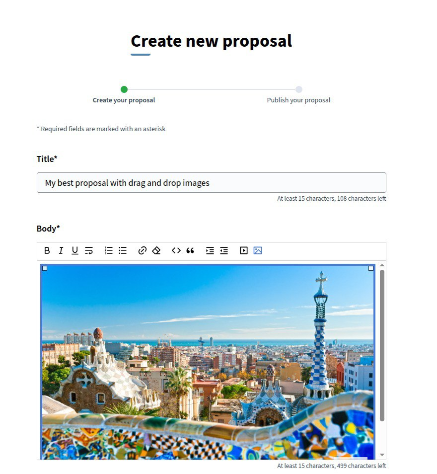
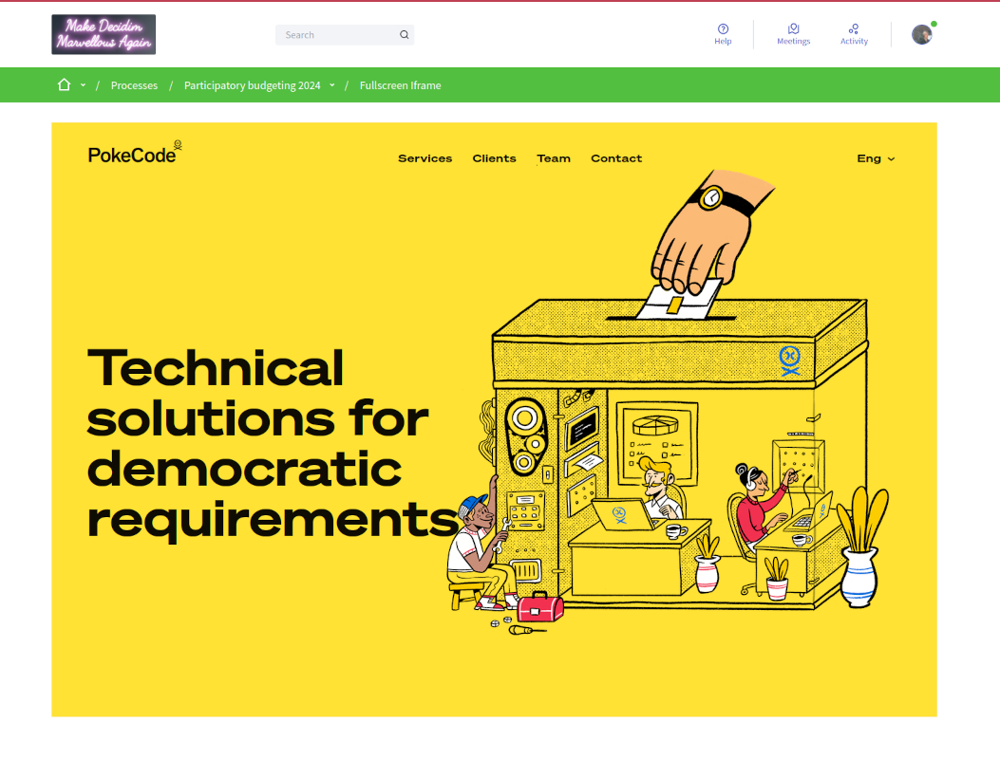
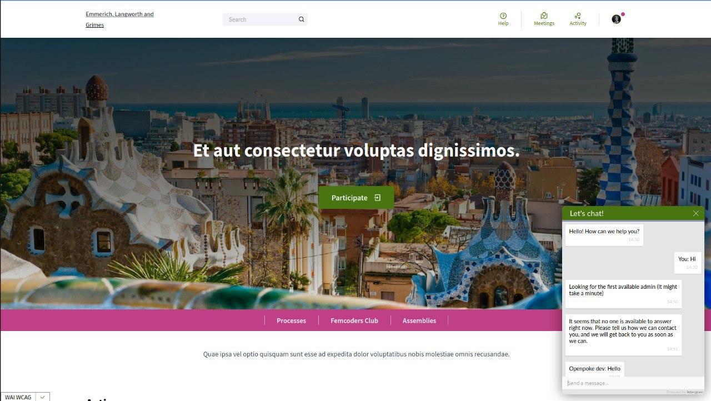

# Decidim::DecidimAwesome

[](https://github.com/Platoniq/decidim-module-decidim_awesome/actions)
[](https://codeclimate.com/github/Platoniq/decidim-module-decidim_awesome/maintainability)
[](undefined)

Usability and UX tweaks for Decidim.

This plugin allows the administrators to expand the possibilities of Decidim beyond some existing limitations. 
All tweaks are provided in a optional fashion with granular permissions that let the administrator to choose exactly where to apply those mods. Some tweaks can be applied to any assembly, other in an specific participatory process or even in type of component only.

**This in beta status, we do not accept any responsibility for breaking anything. Feedback is appreciated though.**

## Why this plugin?

At Platoniq, we like to explore and combine open tools for enriching democracy in many levels. And also for organizations or companies, not only governments.
Currently we are working very closely with the team behind [Decidim](https://decidim.org) because we believe that it is a great software.

However in Platoniq we have this slogan: "Democracy is fun if you take it seriously" (feel free to ask for T-shirts 😉). 
And, let's face it, sometimes we feel that Decidim lacks a bit of the "fun" part so we created this.
Because Decidim is awesome and so is this!

## Usage

Read the [CHANGELOG](CHANGELOG.md) for Decidim compatibility.

DecidimAwesome is a module that hacks Decidim in order to provide more features or improve some aspects of it.

It generates and admin module that allows to choose what hacks to apply.
Each hack can be scoped to one or more specific participatory spaces or components.

### Tweaks:

#### 1. Image support for the Quill editor

Modifies the WYSIWYG editor in Decidim by adding the possibility to insert images. When uploading images, Drag & Drop is supported. Images will be uploaded to the server and inserted as external resources (it doesn't use base64 inline encoding).

This feature allows you use images in newsletters as well.



#### 2. Auto-save for surveys and forms

With this feature admins can activate (globally or scoped) an auto-save feature for any form in Decidim.

It works purely in the client side by using LocalStorage capabilities of the browser. Data is store every time any field changes and retrieved automatically if the same user with the same browser returns to it in the future.

Saving the form removes the stored data.


#### 3. Images in proposals

Event if you haven't activated the WYSIWYG editor (Quill) in public views (eg: proposals use a simple textarea if rich text editor has not been activated for users). You can allow users to upload images in them by drag & drop over the text area.


#### 4. Markdown editor for proposals

Allows to use markdown when creating proposals instead of a bare textarea.

#### 5. Admin scope configuration

All tweaks can be configured and scoped to a specific participatory space, a type of participatory space, a type of component or a specific component.

Many scopes can be defined for every tweak.


#### 6. Awesome map component

This is a component you can add in any participatory space. It retrieves all the geolocated content in that participatory space (meetings or proposals) and displays it in a big map.

It also provides a simple search by category, each category is assignated to a different color.


#### 7. Allow Decidim to use custom CSS themes for every tenant

When customizind CSS for a Decidim installation, each change affects all the organizations (tenant).

This feature allows to customize each organization css without affecting the others in the same Decidim installation.

##### To create a theme

1. Get your hostname for the organization, theme search will be based on this (e.g: `myorganization.com`)
2. Create in you Decidim application this folder: `app/assets/themes/`
3. Create a file in that folder with the same name as the host and suffixed `.css` or `.scss` (e.g: `app/assets/themes/myorganization.com.scss`)
4. Modify that file as you like, you can use any SASS function available (such as `@import`)
5. Restart your server, enjoy!

See an example here: 
https://github.com/Platoniq/decidim-demo/tree/master/app/assets/themes

NOTE: Files presents in the `app/assets/themes` folder are added automatically into the precompile list of Rails by this plugin.

#### 8. Fullscreen Iframe component

Another simple component that can be used to embed and Iframe with any external content in it that fills all the viewport.



#### 9. Live support chat

With this feature you can have a support chat in Decidim. It is linked to a [Telegram](https://telegram.org/) group or a single user chat using the [[IntergramBot](https://web.telegram.org/#/im?p=@IntergramBot). Just invite the bot to a group or chat with it directly, grab your ID, put it on the Awesome settings and have fun!. For more info or for hosting your own version of the bot check the [Intergram project](https://github.com/idoco/intergram).




#### To be continued...

Some things in the road-map: 

1. Improve the conversation in comments by allowing images
1. Direct export of surveys in PDF
1. Allow to create surveys where the responding user is known
1. Propose something! or even better send a PR!

## Installation

Add this line to your application's Gemfile:

```ruby
gem "decidim-decidim_awesome", "~> 0.6.1"
```

And then execute:

```bash
bundle
bundle exec rails decidim_decidim_awesome:install:migrations
bundle exec rails db:migrate
```

Depending on your Decidim version, choose the corresponding Awesome version to ensure compatibility:

| Awesome version | Compatible Decidim versions |
|---|---|
| 0.5.x | 0.21.x, 0.22.x |
| 0.6.x | 0.22.x, 0.23.x |

## Configuration

Each tweak can be enabled or disabled by default. It also can be deactivated so 
admins do not even see it.

In order to personalize default values, create an initializer such as:

```ruby
# config/initializers/awesome_defaults.rb

# Change some variables defaults
Decidim::DecidimAwesome.configure do |config|
  # Enabled by default to all scopes, admins can still limit it's scope
  config.allow_images_in_full_editor = true

  # Disabled by default to all scopes, admins can enable it and limit it's scope
  config.allow_images_in_small_editor = false

  # De-activated, admins don't even see it as an option
  config.use_markdown_editor = :disabled
end
```

For a complete list of options take a look at the [module defaults](lib/decidim/decidim_awesome.rb).

## Missing something?

We add new features and maintain them, however we do it according our needs as this is mostly voluntary work.
So if you feel that you can contribute feel free to create a pull request with your idea. We are open to incorporate anything reasonable.

We do ask some things:
- Each feature has to come with and activation option, same as the already existing (unless is something that do not modify predefined Decidim behavior)
- Try to avoid views or assets overrides. Many times it is just enough to add additional css or scripts that alter existing objects.

You can also ask for new feature by creating and issue and, if you are ready to provide funds for its development just contact us!

Thanks!

## Developing

To start contributing to this project, first:

- Install the basic dependencies (such as Ruby and PostgreSQL)
- Clone this repository

Decidim's main repository also provides a Docker configuration file if you
prefer to use Docker instead of installing the dependencies locally on your
machine.

You can create the development app by running the following commands after
cloning this project:

```bash
bundle
DATABASE_USERNAME=<username> DATABASE_PASSWORD=<password> bundle exec rake development_app
```

Note that the database user has to have rights to create and drop a database in
order to create the dummy test app database.

Then to test how the module works in Decidim, start the development server:

```bash
cd development_app
DATABASE_USERNAME=<username> DATABASE_PASSWORD=<password> bundle exec rails s
```

In case you are using [rbenv](https://github.com/rbenv/rbenv) and have the
[rbenv-vars](https://github.com/rbenv/rbenv-vars) plugin installed for it, you
can add the environment variables to the root directory of the project in a file
named `.rbenv-vars`. If these are defined for the environment, you can omit
defining these in the commands shown above.

### Code Styling

Please follow the code styling defined by the different linters that ensure we
are all talking with the same language collaborating on the same project. This
project is set to follow the same rules that Decidim itself follows.

[Rubocop](https://rubocop.readthedocs.io/) linter is used for the Ruby language.

You can run the code styling checks by running the following commands from the
console:

```
bundle exec rubocop
```

To ease up following the style guide, you should install the plugin to your
favorite editor, such as:

- Atom - [linter-rubocop](https://atom.io/packages/linter-rubocop)
- Sublime Text - [Sublime RuboCop](https://github.com/pderichs/sublime_rubocop)
- Visual Studio Code - [Rubocop for Visual Studio Code](https://github.com/misogi/vscode-ruby-rubocop)

### Testing

To run the tests run the following in the gem development path:

```bash
bundle
DATABASE_USERNAME=<username> DATABASE_PASSWORD=<password> bundle exec rake test_app
DATABASE_USERNAME=<username> DATABASE_PASSWORD=<password> bundle exec rspec
```

However, this project also make use of the gem [Appraisals](https://github.com/thoughtbot/appraisal) in order to test against several versions of Decidim. The idea is to support same supported versions of Decidim.

You can run run all tests against all Decidim versions by using:

```bash
bundle exec appraisal install
DATABASE_USERNAME=<username> DATABASE_PASSWORD=<password> bundle exec appraisal rake test_app
DATABASE_USERNAME=<username> DATABASE_PASSWORD=<password> bundle exec appraisal rspec
```

To test a specific apprasail configured version do the following:

```
DATABASE_USERNAME=<username> DATABASE_PASSWORD=<password> bundle exec appraisal decidim-0.23 rake test_app
DATABASE_USERNAME=<username> DATABASE_PASSWORD=<password> bundle exec appraisal decidim-0.23 rspec
```

Note that the database user has to have rights to create and drop a database in
order to create the dummy test app database.

In case you are using [rbenv](https://github.com/rbenv/rbenv) and have the
[rbenv-vars](https://github.com/rbenv/rbenv-vars) plugin installed for it, you
can add these environment variables to the root directory of the project in a
file named `.rbenv-vars`. In this case, you can omit defining these in the
commands shown above.

### Test code coverage

If you want to generate the code coverage report for the tests, you can use
the `SIMPLECOV=1` environment variable in the rspec command as follows:

```bash
SIMPLECOV=1 bundle exec rspec
```

This will generate a folder named `coverage` in the project root which contains
the code coverage report.

### Appraisals commands

The [Appraisals](Appraisals) file contains the supported versions. In i each version defines the changes respect to the main `Gemfile`.

Appraisal uses custom gems for testing in the folder `gemfiles`, these gemfiles are generated from the file `Appraisals`. To update definitions do:

```
bundle exec appraisal install
```

The former command will take care of updating all configured version. To update the Appraisal definitions manually (not usually necessary) do the following:

```
cd gemfiles
BUNDLE_GEMFILE=./decidim_0.XX.gemfile bundle update
```

Where 0.XX is the supported version that needs to be updated.

### Localization

If you would like to see this module in your own language, you can help with its
translation at Crowdin:

https://crowdin.com/translate/decidim-awesome

## License

This engine is distributed under the GNU AFFERO GENERAL PUBLIC LICENSE.

## Credits

This plugin has been developed by 
