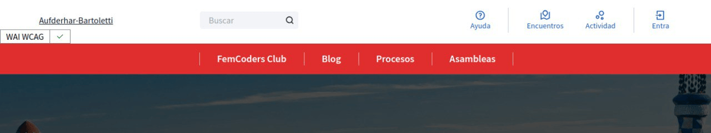
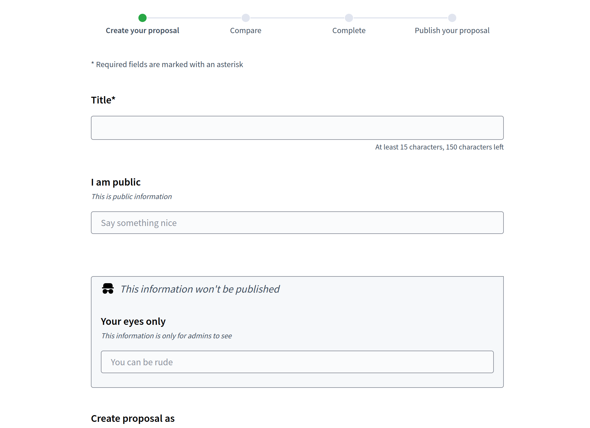
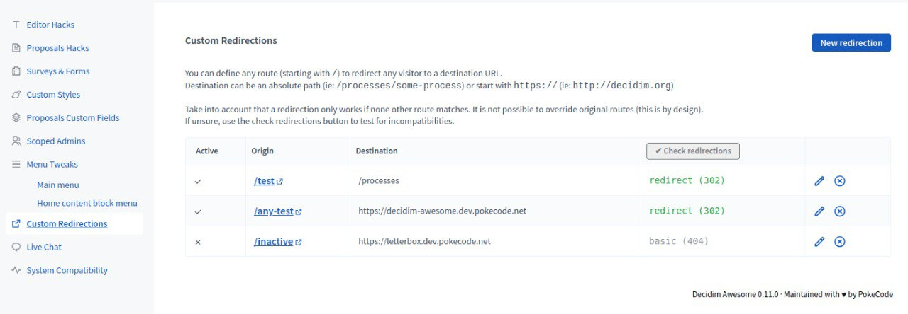
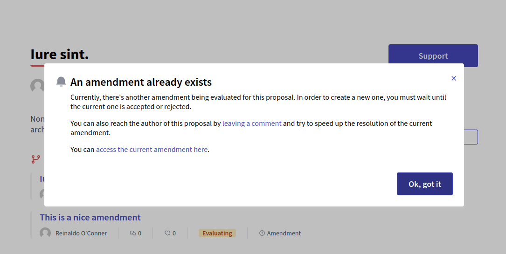
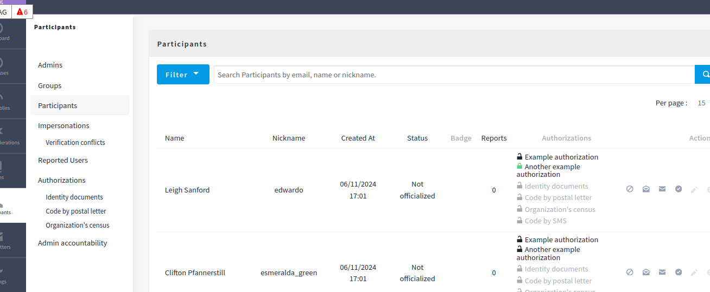
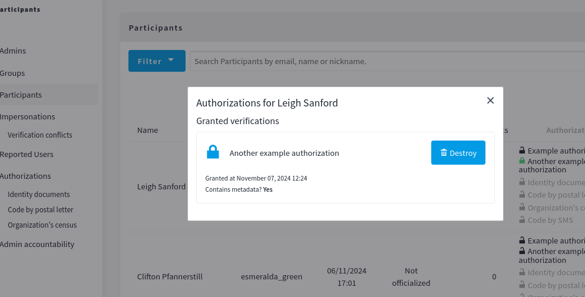
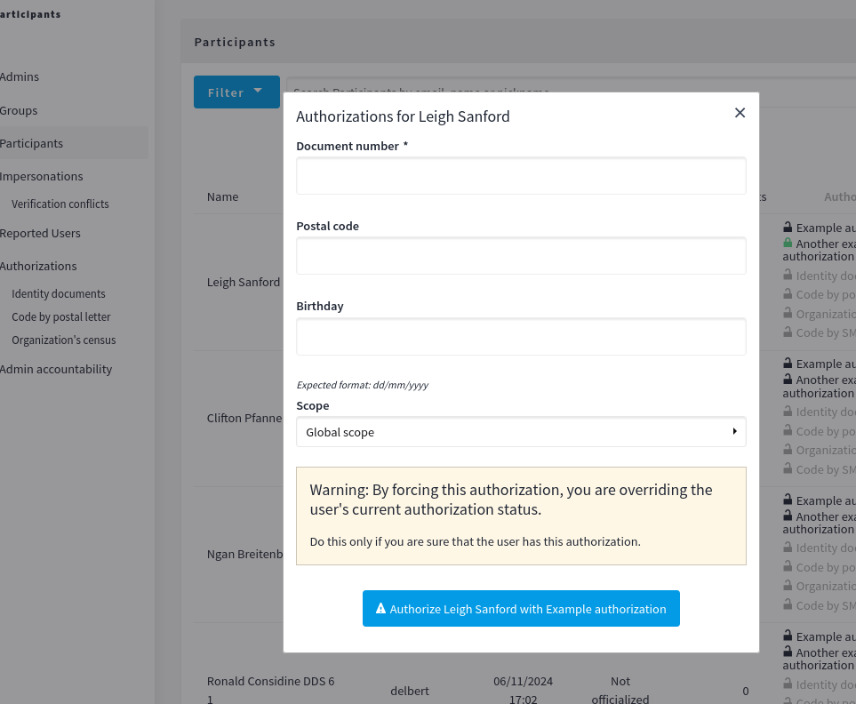

# Decidim::DecidimAwesome

[![[CI] Tests 0.27](https://github.com/decidim-ice/decidim-module-decidim_awesome/actions/workflows/tests.yml/badge.svg)](https://github.com/decidim-ice/decidim-module-decidim_awesome/actions/workflows/tests.yml)
[![[CI] Tests 0.26](https://github.com/decidim-ice/decidim-module-decidim_awesome/actions/workflows/tests-legacy.yml/badge.svg)](https://github.com/decidim-ice/decidim-module-decidim_awesome/actions/workflows/tests-legacy.yml)
[![[CI] Lint](https://github.com/decidim-ice/decidim-module-decidim_awesome/actions/workflows/lint.yml/badge.svg)](https://github.com/decidim-ice/decidim-module-decidim_awesome/actions/workflows/lint.yml)
[![[CI] Precompile](https://github.com/decidim-ice/decidim-module-decidim_awesome/actions/workflows/precompile.yml/badge.svg)](https://github.com/decidim-ice/decidim-module-decidim_awesome/actions/workflows/precompile.yml)
[](https://codeclimate.com/github/decidim-ice/decidim-module-decidim_awesome/maintainability)
[](https://codecov.io/gh/decidim-ice/decidim-module-decidim_awesome)

Usability and UX tweaks for Decidim.

This plugin allows the administrators to expand the possibilities of Decidim beyond some existing limitations.
All tweaks are provided in a optional fashion with granular permissions that let the administrator to choose exactly where to apply those mods. Some tweaks can be applied to any assembly, other in an specific participatory process or even in type of component only.

**DISCLAIMER: This module is heavily tested and widely used, however we do not accept any responsibility for breaking anything. Feedback is appreciated though.**

## Why this plugin?

Decidim is an awesome platform, but it has some limitations that can be annoying for the users or the admins. This plugin tries to solve some of them. See the list of tweaks below.

## Usage

Read the [CHANGELOG](CHANGELOG.md) for Decidim compatibility.

> **TL;DR people**: Jump to the [installation part](#installation)

DecidimAwesome is a module that hacks Decidim in order to provide more features or improve some aspects of it.

It generates and admin module that allows to choose what hacks to apply.
Each hack can be scoped to one or more specific participatory spaces or components.

### Tweaks:

#### 1. Image support for the Quill editor

Modifies the WYSIWYG editor in Decidim by adding the possibility to insert images. When uploading images, Drag & Drop is supported. Images will be uploaded to the server and inserted as external resources (it doesn't use base64 in-line encoding).

This feature allows you use images in newsletters as well.


#### 2. Auto-save for surveys and forms

With this feature admins can activate (globally or scoped) an auto-save feature for any form in Decidim.

It works purely in the client side by using LocalStorage capabilities of the browser. Data is store every time any field changes and retrieved automatically if the same user with the same browser returns to it in the future.

Saving the form removes the stored data.


#### 3. Images in proposals

Event if you haven't activated the WYSIWYG editor (Quill) in public views (eg: proposals use a simple textarea if rich text editor has not been activated for users). You can allow users to upload images in them by drag & drop over the text area.


#### 4. Markdown editor for proposals

Allows to use markdown when creating proposals instead of a bare textarea.

#### 5. Admin scope configuration

All tweaks can be configured and scoped to a specific participatory space, a type of participatory space, a type of component or a specific component.

Many scopes can be defined for every tweak.


#### 6. Awesome map component

This is a component you can add in any participatory space. It retrieves all the geolocated content in that participatory space (meetings or proposals) and displays it in a big map.

It also provides a simple search by category, each category is assigned to a different color.


#### 7. Fullscreen Iframe component

Another simple component that can be used to embed and Iframe with any external content in it that fills all the viewport.


#### 8. Live support chat

With this feature you can have a support chat in Decidim. It is linked to a [Telegram](https://telegram.org/) group or a single user chat using the [[IntergramBot](https://web.telegram.org/#/im?p=@IntergramBot). Just invite the bot to a group or chat with it directly, grab your ID, put it on the Awesome settings and have fun!. For more info or for hosting your own version of the bot check the [Intergram project](https://github.com/idoco/intergram).


#### 9. Custom CSS applied only according scoped restrictions

##### 8.1 Public styles
With this feature you can create directly in the admin a CSS snipped that is only applied in the public frontend, in a particular assembly or even a single proposal!


##### 8.2 Admin styles
With this feature you can create directly in the admin a CSS snipped that is only applied in the admin panel, in a particular assembly or even a single proposal!


#### 10. Change the main menu of Decidim entirely!

Feel free to hide, modify or add items in the Decidim's main menu. You can also change the order, establish some conditions (like showing only for logged users) or open in a new window.




#### 11. Assign admins to specific scopes and prevent them modify anything else

Convert any user on the platform (that is not currently an admin) to a limited subset of participatory spaces or event components. Just add users to a box and scope them to some constraints. These users will see the "Edit" button in everywhere they have permissions. Any access to non allowed zones will redirect the user to the admin index page.


#### 12. Custom fields for proposals

Now admins can substitute the body of a proposal with a set of form fields.
Edition is make with a Drag & Drop interface in the admin and can (and should) be scoped to apply only to certain proposal components.

Technically, the content is stored in the database as an XML document compatible with normal HTML (it uses the DL/DT/DD elements).


Note that the custom fields are build using the jQuery library [formBuilder](https://formbuilder.online). This package is included in Decidim Awesome but the i18n translations are not. By default they are dynamically downloaded from the CDN https://cdn.jsdelivr.net/npm/formbuilder-languages@1.1.0/.
If you wish to provide an alternative place for those files, you can configure the variable `form_builder_langs_location` in an initializer:

```ruby
# config/initializers/awesome_defaults.rb

# A URL where to obtain the translations for the FormBuilder component
# you can a custom place if you are worried about the CDN geolocation
# Download them from https://github.com/kevinchappell/formBuilder-languages

# For instance, copy them to your /public/fb_locales/ directory and set the path here:
Decidim::DecidimAwesome.configure do |config|
  config.form_builder_langs_location = "/fb_locales/"
end
```

##### 12.1. GraphQL types for custom fields

Custom fields are displayed in the GaphQL API according to their definition in a formatted array of objects in the attribute `bodyFields`.

A query to extract this information could look like this (see that the original `body` is also available):

```graphql
{
  component(id: 999) {
    ... on Proposals {
      proposals {
        edges {
          node {
            id
            bodyFields {
              locales
              translation(locale: "en")
              translations {
                locale
                fields
                machineTranslated
              }
            }
            body {
              locales
              translations {
                locale
                text
                machineTranslated
              }
            }
          }
        }
      }
    }
  }
}
```

You can then use this custom type in your GraphQL queries and mutations to handle the custom fields in proposals.


##### 12.2. Private Custom fields

Similar to the custom fields feature, but only admins can see the content of the fields. This is useful for adding metadata to proposals that should not be visible to the public (such as contact data).
Data is stored encrypted in the database.



#### 13. Custom Redirections (or URL shortener feature)

Admins can create custom paths that redirect to other places. Destinations can be internal absolute paths or external sites.
There's also possible to choose to sanitize (ie: remove) any query string or to maintain it (so you can decide to use).

For instance you can create a redirection like

* `/take-me-somewhere` => `/processes/canary-islands`

Using a link with a query string (ie: `/take-me-somewhere?locale=es`) that will redirect the user to:

* `/processes/canary-islands` if query string is sanitized
* `/processes/canary-islands?locale=es` if query string is not sanitized

> Redirections work only after all other routes have been processed, you cannot override an existing route.
> The admin panel comes with a button to check if the redirection works (meaning that no other route is used by the application).
> Non-working routes will simply be ignored.



#### 14. Custom validation rules for title and body in proposals

Configure as you wish how the fields "title" and "body" are validated in proposals creation.

Rules available:

* Minimum title and body length (defaults to 15 chars).
* Maximum percentage of capital letters for title and body (defaults to 25%).
* Maximum number of "marks" (aka: exclamation and interrogation signs) that can be consecutive in the title or the body (defaults to 1).
* Enable/disable forcing to start the title or the body with a capital letter (defaults to "enabled").


#### 15. Admin accountability

This feature allows you to list all the users that are, or have been at any point in time, admins, valuators, user managers or any other role in Decidim. Including global admin roles or private admins of a particular participatory space.

Results can be filtered by role and by time range and also exported as CSV or other formats.


#### 16. Additional proposal sortings


This feature allows you to add additional sorting options to the proposals component. By default 4 additional sortings are included:

- `supported_first`: Sort proposals supported by me first.
- `supported_last`: Sort proposals supported by me last.
- `az`: Sort proposals alphabetically.
- `za`: Sort proposals alphabetically (reverse).

By enabling this feature the user choosed sorting method will be stored in the browser's session. This means that if the user changes the sorting method and then navigates to another page, the same sorting will be applied.

You can disable or configure the available sorting types by setting the variable `additional_proposal_sortings` configuration in an initializer:

```ruby
# config/initializers/awesome_defaults.rb
Decidim::DecidimAwesome.configure do |config|
  config.additional_proposal_sortings = :disabled
end

# Or, to disable alphabetical sorting:

Decidim::DecidimAwesome.configure do |config|
  config.additional_proposal_sortings = [:supported_first, :supported_last]
end
```

#### 17. Weighted voting

This feature allows you to configure a proposals component to use a weighted voting system. This means that each vote can have a different weight and the result of the vote is calculated as the sum of all the weights.

Weighted voting can have different presentations that can be registered in a manifest. Admins can then choose between what type of voting they want for their proposals according to the different manifests registered (classic is always available).

Some manifests are included by default in Decidim Awesome, if you consider to create (or pay) for a new one, please open a PR or contact us.

For instance, here is how the 3-flag voting system looks like:


##### Creating a new manifest for weighted voting

A manifest is defined in a initializer in this way:

```ruby
if Decidim::DecidimAwesome.enabled?(:weighted_proposal_voting)
  # register available processors
  Decidim::DecidimAwesome.voting_registry.register(:no_admins_vote) do |voting|
    voting.show_vote_button_view = "decidim/decidim_awesome/voting/no_admins_vote/show_vote_button"
    voting.show_votes_count_view = "decidim/decidim_awesome/voting/no_admins_vote/show_votes_count"
    # voting.show_votes_count_view = "" # hide votes count if needed
    voting.proposal_m_cell_footer = "decidim/decidim_awesome/voting/no_admins_vote/proposal_m_cell_footer"
    # define a weight validator (optional, by default all weights are valid)
    voting.weight_validator do |weight, context|
      # don't allow admins to vote
      next if context[:user].admin?
      # don't allow to vote official proposals
      next if context[:proposal].official?

      weight.in? [1, 2, 3, 5]
    end

    # optionally, define a label generator block
    # by default labels are extracted from a I18n key following this rule
    # "decidim.decidim_awesome.voting.{MANIFEST_NAME}.weights.weight_{WEIGHT}"
    #
    # voting.label_generator do |weight, context|
    #   "Weight #{weight.round}"
    # end
  end
end
```

A manifest must define a vote button view for the main proposal view, a vote count view for the proposal list view, a footer for the proposal cell (used in lists) and a validator for the weight value.

All views are optional, if set to `nil` they will use the original ones. If set to an empty string `""` they will be hidden.

The `weight_validator` is a Proc that receives the weight value and the context with the current user and the proposal and returns true or false if the weight is valid or not.

**Notes for view `show_vote_button_view`**

When building a new view for the vote button ([see the original](https://github.com/decidim/decidim/blob/release/0.27-stable/decidim-proposals/app/views/decidim/proposals/proposals/_vote_button.html.erb)) is important to take into account the following situations:

- If there's a `current_user` logged in
- If votes are blocked `if current_settings.votes_blocked?`
- If the user has already voted `if @voted_proposals ? @voted_proposals.include?(proposal.id) : proposal.voted_by?(current_user)`
- If maximum votes have already reached `if proposal.maximum_votes_reached?`
- If the proposal can accumulate supports beyond maximum `if proposal.can_accumulate_supports_beyond_threshold`
- If the current component allows the user to participate `if current_component.participatory_space.can_participate?(current_user)`
- Note that the [original view](https://github.com/decidim/decidim/blob/release/0.27-stable/decidim-proposals/app/views/decidim/proposals/proposals/_vote_button.html.erb) is overridden only inside the tag  `<div id="proposal-<%= proposal.id %>-vote-button" class="button--vote-button">`. You only need to substitute the part inside.

To cast a vote a `POST` action is needed with the parameters `proposal_id`, `from_proposals_list` and `weight`. The route where to send the vote can be constructed such as:

```erb
<%= link_to "Vote with weight=3", proposal_proposal_vote_path(proposal_id: proposal, from_proposals_list: from_proposals_list, weight: 3), remote: true, method: :post %>
```

To delete a vote, you just need to change the method to `:delete`

**Notes for view `show_votes_count_view`**

This view must implement the number of votes already cast. It requires an HTML tag with the id `proposal-<%= proposal.id %>-votes-count`, this is used by the Ajax vote re-loader feature: It will replace it's content with the new number.

You can also completely hide this view (using `voting.show_votes_count_view = ""` in the manifest declaration). This is useful if you are using the same `show_vote_button_view` to also display the total counters (or your implementation does not use that).

**Notes for view `proposal_m_cell_footer`**

This view is used by the proposal cell in lists. It must implement the vote button and the vote count. The vote button must be a link with the same characteristics as the one explained above for the `show_vote_button_view` (typically you can just render the same view using `<%= render partial: my/path/to/view, { locals: model: proposal, from_proposals_list: true } %>`).

Note that, it is strongly recommended to add and HTML tag element with the id `proposal-<%= proposal.id %>-votes-count` so the Ajax vote re-loader can work. Even if you don't use (in this case use a `style="display:none"` attribute), this is because the Ajax reloader always look for this element and throw JavaScript errors if not.

##### 17.1 GraphQL Types for weighted voting

When a weighed voting mechanism is selected, the GraphQL API will show those weights separated in each proposal.
The attribute that holds this information is `vote_weights`, a query example could look like this:

```graphql
{
  component(id: 999) {
    ... on Proposals {
      proposals {
        edges {
          node {
            id
            voteWeights
          }
        }
      }
    }
  }
}
```

#### 18. Limiting amendments in proposals

By default, when proposals can be amended, any number of amendments can be created.

This feature allows admins to configure a specific Proposal's component to limit the number of evaluating amendments that can be created to one.
Note that this only applies to amendments being in the state "evaluating", not to accepted or rejected.

This option is disable by default, must be enabled in the component's configuration:



#### 18. Maintenance tools

The awesome admin provides with some maintenance tools (more to come in the future);

##### 18.1 Old private data removal

These tools are designed to help remove old data as required by laws such as GDPR, particularly in relation to private custom fields.
This menu will show if there's any data older than 6 months (configurable) and will let admins remove it component by component.


#### 19. Mandatory verifications

This feature allows admins to enforce mandatory verifications for users before they can access the platform. Admins can configure which verifications are required.

Admins can manage these settings in the Awesome admin panel under the "Verifications" section.


Note that some pages are allowed, you can even configure which controller are allowed by creating an initializer ("required_authorizations" and "authorizations" are always allowed):

```ruby
# config/initializers/decidim_awesome.rb

Decidim::DecidimAwesome.configure do |config|
  # default controllers are "account" and "pages"
  config.force_authorization_allowed_controller_names = %w(account pages homepage)
```

#### 21. Manual verifications

The admin will be allowed to manually authorize users using the methods specified in the `/system` admin section.
Currently, only form based handlers are supported (Direct methods). 
Admins can manually override or verify users in the participants list but they still have to fulfill the requirements of the verifier (although they will be allowed to force the authorization even if some of them fails).

Admin logs are also created in each action for accountability.

System configuration:






#### To be continued...

We're not done! Please check the [issues](/decidim-ice/decidim-module-decidim_awesome/issues) (and participate) to see what's on our mind

Also feel free to propose something! or even better send a PR!

## Installation

Add this line to your application's Gemfile:

```ruby
gem "decidim-decidim_awesome"
```

And then execute:

```bash
bundle
bundle exec rails decidim_decidim_awesome:install:migrations
bundle exec rails decidim:upgrade
bundle exec rails db:migrate
```

Go to `yourdomain/admin/decidim_awesome` and start tweaking things!

> **EXPERTS ONLY**
>
> Under the hood, when running `bundle exec rails decidim:upgrade` the `decidim-decidim_awesome` gem will run the following two tasks (that can also be run manually if you consider):
>
> ```bash
> bin/rails decidim_decidim_awesome:install:migrations
> bin/rails decidim_decidim_awesome:webpacker:install
> ```

If you are upgrading from a version prior to 0.8, make sure to visit the URL `/admin/decidim_awesome/checks` and run image migrations for the old images:


If you are a system admin, you can also perform this task by executing this rake task in the console:

```
RAILS_ENV=production bin/rails decidim_awesome:active_storage_migrations:migrate_from_carrierwave
```

Or check your migration status with:
```
RAILS_ENV=production bin/rails decidim_awesome:active_storage_migrations:check_migration_from_carrierwave
```

The correct version of Decidim Awesome should resolved automatically by the Bundler.
However you can force some specific version using `gem "decidim-decidim_awesome", "~> 0.10.0"` in the Gemfile.

Depending on your Decidim version, choose the corresponding Awesome version to ensure compatibility:

| Awesome version | Compatible Decidim versions |
|-----------------|-----------------------------|
| 0.10.x          | >= 0.26.7, >= 0.27.3        |
| 0.9.2           | >= 0.26.7, >= 0.27.3        |
| 0.9.x           | 0.26.x, 0.27.x              |
| 0.8.x           | 0.25.x, 0.26.x              |
| 0.7.x           | 0.23.x, 0.24.x              |
| 0.6.x           | 0.22.x, 0.23.x              |
| 0.5.x           | 0.21.x, 0.22.x              |

> *Heads up!*
> * version 0.10.0 requires database migrations! Don't forget the migrations step when updating.
> * version 0.8.0 removes CSS Themes for tenants. If you have been using them you will have to manually migrate them to custom styles.
> * version 0.8.0 uses ActiveStorage, same as Decidim 0.25. 2 new rake task have been introduced to facilitate the migration: `bin/rails decidim_awesome:active_storage_migrations:check_migration_from_carrierwave` and
    `bin/rails decidim_awesome:active_storage_migrations:migrate_from_carrierwave`
> * version 0.7.1 requires database migrations! Don't forget the migrations step when updating.

## Configuration

Each tweak can be enabled or disabled by default. It also can be deactivated so
admins do not even see it.

In order to personalize default values, create an initializer such as:

> **NOTE**: this is not necessary unless you want to **disable** some features. All features are enabled by default.

```ruby
# config/initializers/awesome_defaults.rb

# Change some variables defaults
Decidim::DecidimAwesome.configure do |config|
  # Enabled by default to all scopes, admins can still limit it's scope
  config.allow_images_in_full_editor = true

  # Disabled by default to all scopes, admins can enable it and limit it's scope
  config.allow_images_in_small_editor = false

  # De-activated, admins don't even see it as an option
  config.use_markdown_editor = :disabled

  # Disable scoped admins
  config.scoped_admins = :disabled

  # any other config var from lib/decidim/decidim_awesome.rb
  ...
end
```

For a complete list of options take a look at the [module defaults](lib/decidim/decidim_awesome.rb).

## Missing something?

We add new features and maintain them, however we do it according our needs as this is mostly voluntary work.
So if you feel that you can contribute feel free to create a pull request with your idea. We are open to incorporate anything reasonable.

We do ask some things:
- Each feature has to come with and activation option, same as the already existing (unless is something that do not modify predefined Decidim behavior)
- Try to avoid views or assets overrides. Many times it is just enough to add additional css or scripts that alter existing objects.

You can also ask for new feature by creating and issue and, if you are ready to provide funds for its development just contact us!

Thanks!

## Developing

To start contributing to this project, first:

- Install the basic dependencies (such as Ruby and PostgreSQL)
- Clone this repository

Decidim's main repository also provides a Docker configuration file if you
prefer to use Docker instead of installing the dependencies locally on your
machine.

You can create the development app by running the following commands after
cloning this project:

```bash
bundle
DATABASE_USERNAME=<username> DATABASE_PASSWORD=<password> bundle exec rake development_app
```

Note that the database user has to have rights to create and drop a database in
order to create the dummy test app database.

Then to test how the module works in Decidim, start the development server:

```bash
cd development_app
DATABASE_USERNAME=<username> DATABASE_PASSWORD=<password> bundle exec rails s
```

In case you are using [rbenv](https://github.com/rbenv/rbenv) and have the
[rbenv-vars](https://github.com/rbenv/rbenv-vars) plugin installed for it, you
can add the environment variables to the root directory of the project in a file
named `.rbenv-vars`. If these are defined for the environment, you can omit
defining these in the commands shown above.

### Code Styling

Please follow the code styling defined by the different linters that ensure we
are all talking with the same language collaborating on the same project. This
project is set to follow the same rules that Decidim itself follows.

[Rubocop](https://rubocop.readthedocs.io/) linter is used for the Ruby language.

You can run the code styling checks by running the following commands from the
console:

```
bundle exec rubocop
```

To ease up following the style guide, you should install the plugin to your
favorite editor, such as:

- Atom - [linter-rubocop](https://atom.io/packages/linter-rubocop)
- Sublime Text - [Sublime RuboCop](https://github.com/pderichs/sublime_rubocop)
- Visual Studio Code - [Rubocop for Visual Studio Code](https://github.com/misogi/vscode-ruby-rubocop)

### Testing

To run the tests run the following in the gem development path:

```bash
bundle
DATABASE_USERNAME=<username> DATABASE_PASSWORD=<password> bundle exec rake test_app
DATABASE_USERNAME=<username> DATABASE_PASSWORD=<password> bundle exec rspec
```

However, this project works with different versions of Decidim. In order to test them all, we maintain two different Gemfiles: `Gemfile` and `Gemfile.legacy`. The first one is used for development and testing the latest Decidim version supported, the second one is used for testing against the old Decidim version.

You can run run tests against the legacy Decidim versions by using:

```bash
export DATABASE_USERNAME=<username>
export DATABASE_PASSWORD=<password>
RBENV_VERSION=2.7.6 BUNDLE_GEMFILE=Gemfile.legacy bundle
RBENV_VERSION=2.7.6 BUNDLE_GEMFILE=Gemfile.legacy bundle exec rake test_app
RBENV_VERSION=2.7.6 BUNDLE_GEMFILE=Gemfile.legacy bundle exec rspec
```

For convenience, you can use the scripts `bin/rspec` and `bin/rspec-legacy` to run tests against one or the other version:

```bash
bin/rspec spec/
bin/rspec-legacy spec/
```

- Rbenv is required for this script to work.

> **NOTE:** Remember to reset the database when changing between tests:
> ```bash
> bin/rspec --reset
> bin/rspec-legacy --reset
> ```


Note that the database user has to have rights to create and drop a database in
order to create the dummy test app database.

In case you are using [rbenv](https://github.com/rbenv/rbenv) and have the
[rbenv-vars](https://github.com/rbenv/rbenv-vars) plugin installed for it, you
can add these environment variables to the root directory of the project in a
file named `.rbenv-vars`. In this case, you can omit defining these in the
commands shown above.

### Test code coverage

Code coverage report is generated automatically in a folder named `coverage` in the project root which contains
the code coverage report.

```bash
firefox coverage/index.html
```

### Localization

If you would like to see this module in your own language, you can help with its
translation at Crowdin:

https://crowdin.com/translate/decidim-awesome

## License

This engine is distributed under the GNU AFFERO GENERAL PUBLIC LICENSE.

## Credits

This plugin maintainted by 
