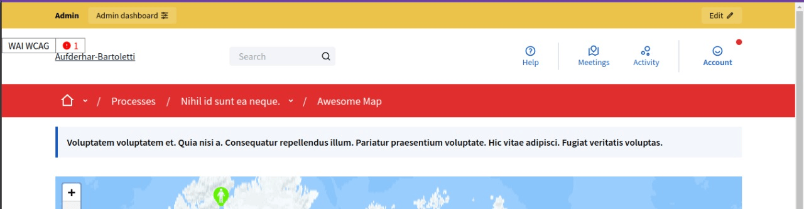
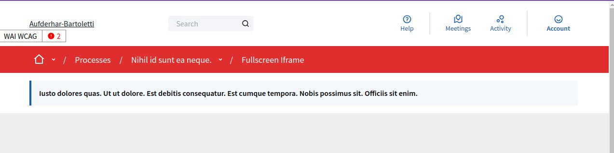
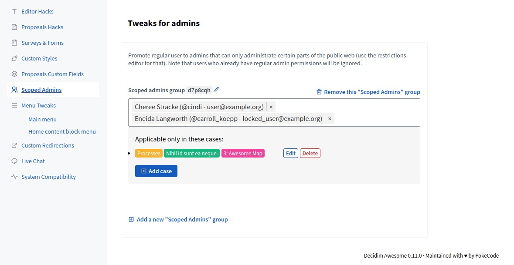
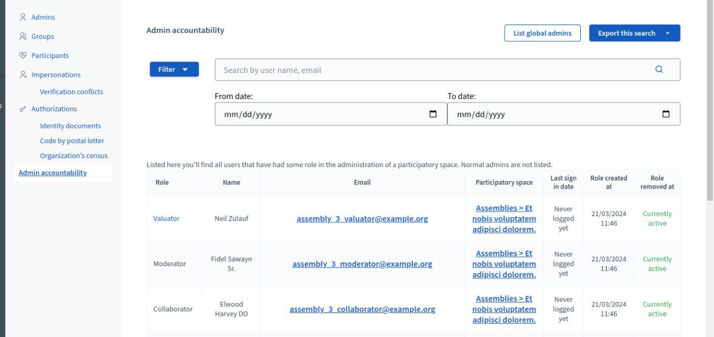
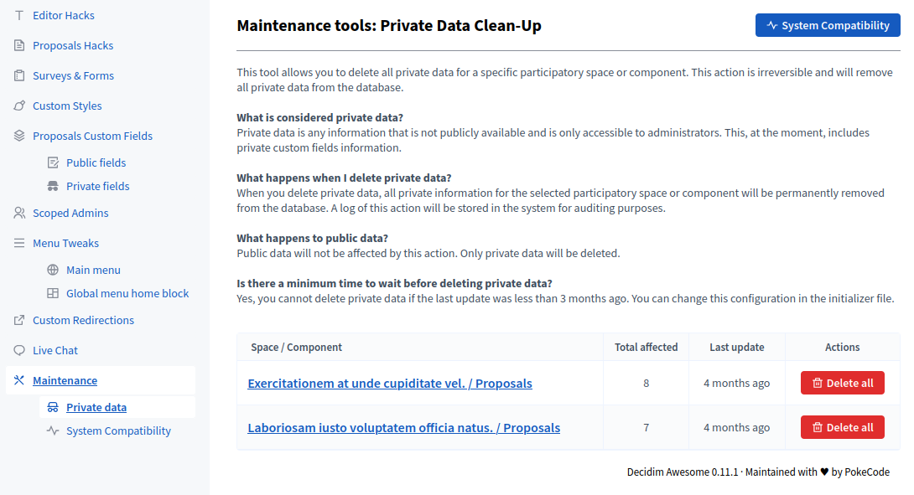

# Admin governance and accountability

## Tweaks

Global scoping behavior is documented in [Global mechanisms](global-mechanisms.md).

### 3.1 Scoped admins

Delegates limited admin powers to selected users and restricts actions outside allowed scopes.

#### Admin description

Distributes moderation and community management across team members without granting system-wide admin access.
Concerns: permissions can be accidentally too broad; regularly audit who has admin roles. Clear job descriptions prevent scope creep.
Recommend role templates for common tasks (moderator, space manager, component reviewer).

#### Technical area

- **Enabling/Disabling:** Set regular values to keep feature available; use `:disabled` to remove it from admin UI entirely

```ruby
# config/initializers/awesome_defaults.rb
Decidim::DecidimAwesome.configure do |config|
  config.scoped_admins = :disabled  # completely removed, hidden from admins
  # OR configure with default scoped admin IDs (admin can still override):
  # config.scoped_admins = { "default" => [123, 456] }
end
```

- **Roles:** Define custom admin roles with scoped permissions (e.g., "Community Manager — Budget 2025")
- **Scope enforcement:** Scoped admins cannot view/edit outside their assigned scopes; enforced server-side
- **Audit trail:** Scoped admin actions logged in accountability system (Tweak 3.2)
- **Revocation:** Removing scoped admin access is immediate; no stale permission caches
- **Security:** Similar security model to standard Decidim roles; no privilege escalation vector
- **Conflict:** Incompatible with certain global admin powers (system backups, user deletion); clearly marked in role setup
- **Dependency:** Complements global scope restrictions for operational separation of concerns





### 3.2 Admin accountability

Provides role/activity visibility for admin-like users over time, with filtering and export capabilities.

#### Admin description

Tracks who did what and when for compliance, internal governance, and dispute resolution.
Concerns: logs can grow large; implement retention policies to prevent database bloat. Sensitive data in logs should be treated as confidential.
Recommend periodic audit exports for legal/governance review; archive older logs if performance concerns arise.

#### Technical area

- **Admin visibility:** Enabled (admins see accountability views in admin UI)
- **Default behavior:** Enabled by default, auditing both participatory space roles and admin roles
- **Admin control:** Cannot be toggled per-scope; either enabled globally or completely disabled with `:disabled`

- **Data retention:** Logs stored indefinitely; configure retention/archival policies per deployment needs
- **Access:** Admin UI provides filtered accountability views under "Participants" section
- **Logging:** All admin actions automatically captured when enabled

```ruby
# config/initializers/awesome_defaults.rb
Decidim::DecidimAwesome.configure do |config|
  # Enable admin accountability auditing (default: [:participatory_space_roles, :admin_roles])
  config.admin_accountability = [:participatory_space_roles, :admin_roles]
  
  # To completely remove this feature, use:
  # config.admin_accountability = :disabled
  
  # Roles tracked for participatory spaces
  config.participatory_space_roles = [
    "Decidim::AssemblyUserRole",
    "Decidim::ParticipatoryProcessUserRole",
    "Decidim::ConferenceUserRole"
  ]
end
```

- **Querying:** Admin UI allows filter by date range, user, action type, scope; exports to CSV
- **Retention:** No built-in retention period; managed via your audit/versioning store (e.g., PaperTrail) and external DB/maintenance cleanup policies per deployment
- **Performance:** Audit entries are written as part of the normal request/transaction with minimal overhead; exporting runs as a background job. Queries are indexed for fast filtering.
- **GDPR:** User deletion removes logs containing that user's data; consider archival vs. deletion per policy
- **Encrypted fields:** Logs reference (not include) sensitive data; Tweak 2.1.2 (private fields) logged as "value changed" only
- **Export format:** CSV includes timestamp, user, action, affected resource ID, scope for analysis



### 3.3 Maintenance tools

Includes admin utilities for data maintenance tasks (e.g. old private data cleanup).

#### Admin description

Provides operational helpers for data hygiene and compliance (e.g., GDPR right-to-be-forgotten, archival purging).
Concerns: dangerous operations can corrupt data if misconfigured; test on staging first. Backups mandatory before running.
Recommend running during low-traffic windows; some operations are slow and block other admin tasks.

#### Technical area

- **Enabling/Disabling:** Built-in feature; accessed via Admin → Maintenance tools

```ruby
# config/initializers/awesome_defaults.rb
# Maintenance tools configuration (data retention policies)
Decidim::DecidimAwesome.configure do |config|
  # How old data must be before considered expired
  config.private_data_expiration_time = 3.months  # default: 3.months
  
  # Lock time prevents immediate re-deletion after scheduling
  config.lock_time = 1.minute  # default: 1.minute
end
```

- **Operations:** Private data cleanup, old user data removal (after data export), soft-delete restoration, cache invalidation
- **Safety:** Dry-run mode available for most operations; review affected record count before committing
- **Automation:** Can schedule recurring cleanups (e.g., "delete data older than 90 days") if desired
- **Performance:** Long operations run as background jobs; admin UI shows progress
- **Backups:** Essential before running; no undo available; recovery requires restore from backup
- **Logging:** Maintenance operations logged in Tweak 3.2 (accountability) with record count
- **Validation:** Pre-flight checks prevent accidental misuse (e.g., won't allow deletion of active proposals)



## Scope and operations

- Review scope definitions regularly to avoid permission drift.
- Use accountability exports as part of periodic governance audits.
