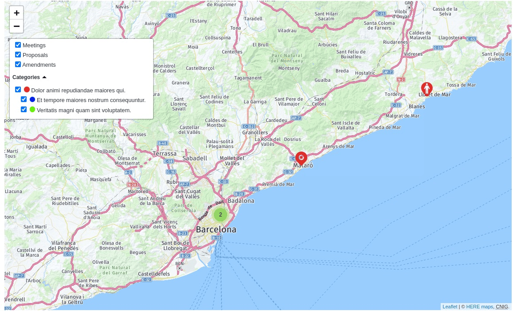
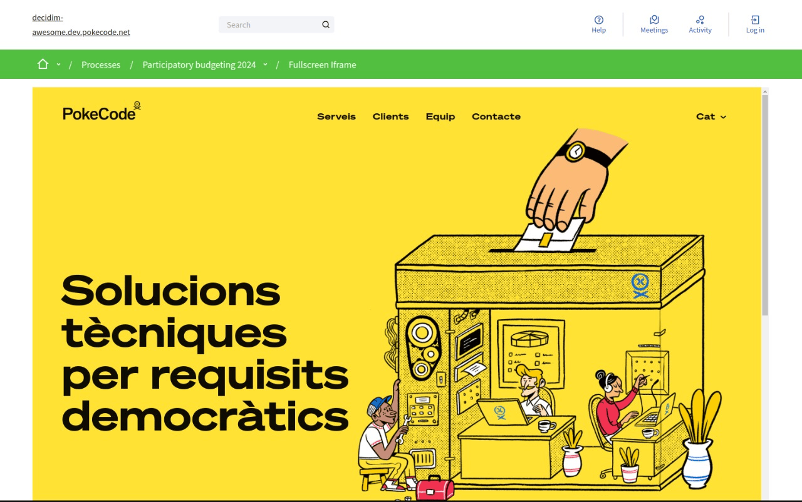
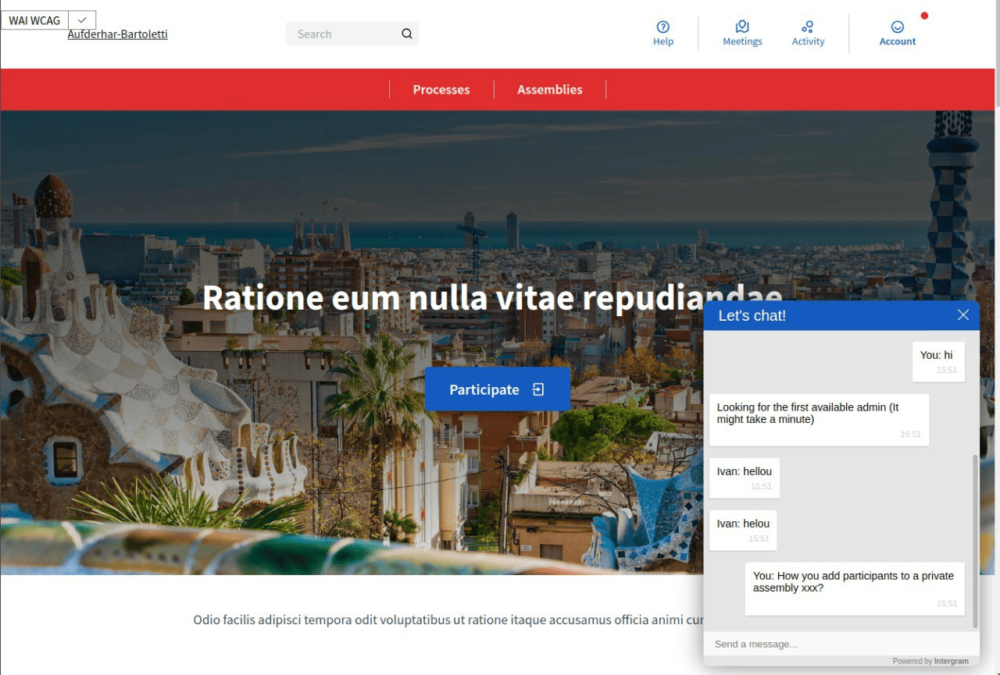

# Components and integrations

## Tweaks

### 6.1 Awesome map component

Displays geolocated content from a participatory space in a map view, with taxonomy-based visual filtering.

#### Admin description

Surfaces location-based content discovery (e.g., participatory budgets with project locations, meetings by venue).

#### Technical area

- **Configuration:** Via initializer (affects component availability in admin panel)

```ruby
# config/initializers/awesome_defaults.rb
Decidim::DecidimAwesome.configure do |config|
  # [] (empty array) = enabled by default (component available in admin UI)
  # [:awesome_map] = disabled (component hidden from admin component creation UI)
  config.disabled_components = []  # default: []
end
```

- **Admin visibility:** Enabled (admins see Awesome Map in component creation)
- **Default behavior:** Enabled by default (available for admins to add to spaces)
- **Admin control:** Yes; admins can create map components per space
- **Data source:** Pulls from components with geographic coordinates (proposals, meetings)
- **Map display:** Leaflet-based map with marker clustering for large datasets
- **Filtering:** Taxonomy filters auto-derived from space categories; participants filter by topic and location together
- **Performance:** Markers lazy-loaded as viewport pans; supports 10k+ locations efficiently



### 6.2 Fullscreen Iframe component

Embeds external content as a full-viewport iframe component in participatory spaces.

#### Admin description

Integrates third-party tools (surveys, visualizations, collaborative platforms) without leaving Decidim.
Concerns: embedded content inherits none of Decidim's styling/theming. Third-party tool updates may break layout.
Recommend testing iframes on mobile; ensure embedded services have responsive design. Verify data privacy of embedded tools.

#### Technical area

- **Configuration:** Via initializer (affects component availability in admin panel)

```ruby
# config/initializers/awesome_defaults.rb
Decidim::DecidimAwesome.configure do |config|
  # [] (empty array) = enabled by default (component available in admin UI)
  # [:awesome_iframe] = disabled (component hidden from admin component creation UI)
  config.disabled_components = []  # default: []
end
```

- **Admin visibility:** Enabled (admins see Fullscreen Iframe in component creation)
- **Default behavior:** Enabled by default (available for admins to add to spaces)
- **Admin control:** Yes; admins can create iframe components per space
- **Framing:** X-Frame-Options respected; some SaaS platforms may block embedding
- **Communication:** No cross-iframe communication (Decidim ↔ embedded app isolated)
- **Mobile:** Fullscreen on desktop; constrained height on mobile for scrollable layout
- **Analytics:** External tool sees its own traffic; Decidim doesn't track internal navigation
- **Security:** It is recommended to load embedded content in a sandboxed iframe and/or restrict allowed `src` origins to limit access to Decidim cookies or session; admins must configure these protections according to their security requirements.
- **Performance:** Iframe content loads asynchronously; doesn't block Decidim page rendering
- **Limitation:** Users cannot access Decidim context from embedded tool (no single sign-on bridge)



### 6.3 Live support chat

Integrates support chat via Telegram/Intergram to provide direct user assistance channels.

#### Admin description

Offers real-time help for confused participants without requiring dedicated support staff in offices.
Concerns: requires Telegram group or external chat service setup. Uncovered hours lead to unmet participant expectations.
Recommend documenting support hours prominently; set expectations about response delays. Monitor chat for common questions (improve help docs).

#### Technical area

- **Configuration:** Via initializer (affects default state globally and per-audience)

```ruby
# config/initializers/awesome_defaults.rb
Decidim::DecidimAwesome.configure do |config|
  # true = enabled by default (visible to users)
  # false = disabled by default (hidden from users, admins CAN enable per-component)
  # :disabled = completely removed, hidden from admins
  config.intergram_for_public = true   # default: true
  config.intergram_for_admins = true   # default: true
end
```

- **Admin visibility:** Enabled (admins see Intergram settings in admin panel)
- **Default behavior:** Enabled by default for both public and admin audiences
- **Admin control:** Yes; admins can hide/show per audience, configure webhook/group ID
- **Backend:** Intergram (third-party) or custom Telegram bot integration
- **Installation:** Admin configures Telegram group ID or Intergram webhook; widget injected into pages
- **Widget:** Chat bubble in bottom-right corner; works on all pages; persistent across navigation
- **Mobile:** Responsive design works on mobile; chat drawer adapts to screen size
- **Privacy:** Chat messages sent to external service (Telegram/Intergram); review privacy terms
- **Data:** Visitor identity optional; can be pre-filled with Decidim username if logged in
- **Moderation:** Chat moderated by Telegram group admins; Decidim has no direct control
- **Offline:** Widget shows canned message if support unavailable; message queuing depends on external service



## Scope and operations

- Review third-party integration implications (availability, moderation, privacy).
- Ensure mobile responsiveness for embedded content (iframes, maps).
