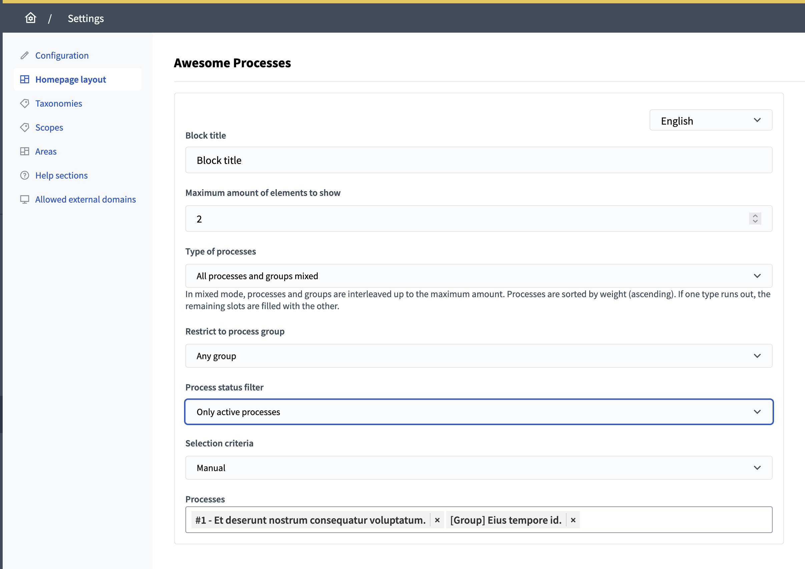
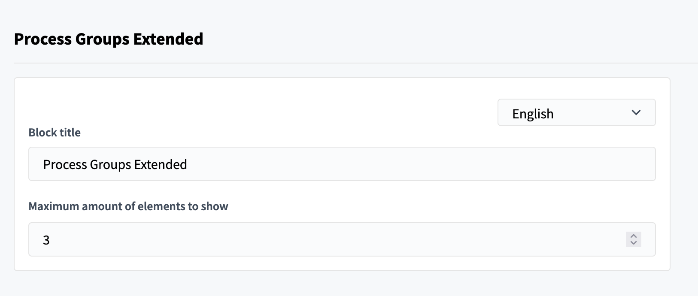
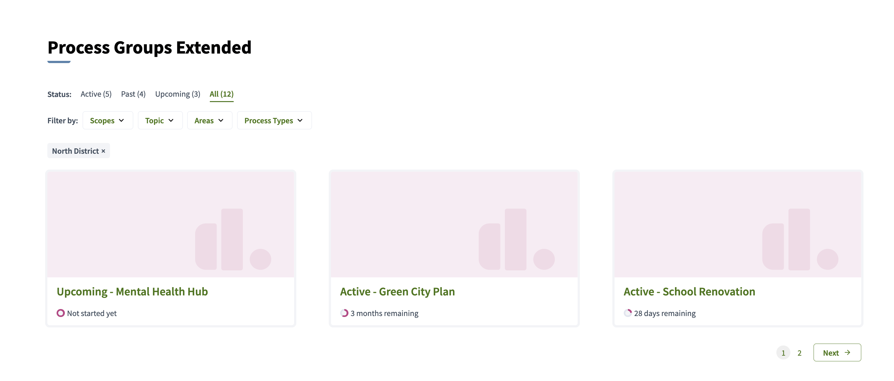

# Components and integrations

## Tweaks

### 6.1 Awesome map component

Displays geolocated content from a participatory space in a map view, with taxonomy-based visual filtering.

#### Admin description

Surfaces location-based content discovery (e.g., participatory budgets with project locations, meetings by venue).
Concerns: data quality critical (missing/incorrect coordinates reduce trust). Requires accurate participant data entry.
Recommend validating addresses before bulk import; provide participant help text on location field importance.

#### Technical area

- **Configuration:** Via initializer (affects component availability in admin panel)

```ruby
# config/initializers/awesome_defaults.rb
Decidim::DecidimAwesome.configure do |config|
  # [] (empty array) = enabled by default (component available in admin UI)
  # [:awesome_map] = disabled (component hidden from admin component creation UI)
  config.disabled_components = []  # default: []
end
```

- **Admin visibility:** Enabled (admins see Awesome Map in component creation)
- **Default behavior:** Enabled by default (available for admins to add to spaces)
- **Admin control:** Yes; admins can create map components per space
- **Data source:** Pulls from components with geographic coordinates (proposals, meetings); custom fields (Tweak 2.1) can add location
- **Map display:** Leaflet-based map with marker clustering for large datasets
- **Filtering:** Taxonomy taxonomies auto-derived from space categories; participants filter by topic and location together
- **Performance:** Markers lazy-loaded as viewport pans; supports 10k+ locations efficiently
- **Mobile:** Responsive; touch-friendly controls
- **Privacy:** Coordinates publicly visible; no IP-based tracking
- **Prerequisites:** Valid latitude/longitude data; optional map tile backend (OSM default)


### 6.2 Fullscreen Iframe component

Embeds external content as a full-viewport iframe component in participatory spaces.

#### Admin description

Integrates third-party tools (surveys, visualizations, collaborative platforms) without leaving Decidim.
Concerns: embedded content inherits none of Decidim's styling/theming. Third-party tool updates may break layout.
Recommend testing iframes on mobile; ensure embedded services have responsive design. Verify data privacy of embedded tools.

#### Technical area

- **Configuration:** Via initializer (affects component availability in admin panel)

```ruby
# config/initializers/awesome_defaults.rb
Decidim::DecidimAwesome.configure do |config|
  # [] (empty array) = enabled by default (component available in admin UI)
  # [:awesome_iframe] = disabled (component hidden from admin component creation UI)
  config.disabled_components = []  # default: []
end
```

- **Admin visibility:** Enabled (admins see Fullscreen Iframe in component creation)
- **Default behavior:** Enabled by default (available for admins to add to spaces)
- **Admin control:** Yes; admins can create iframe components per space
- **Framing:** X-Frame-Options respected; some SaaS platforms may block embedding
- **Communication:** No cross-iframe communication (Decidim ↔ embedded app isolated)
- **Mobile:** Fullscreen on desktop; constrained height on mobile for scrollable layout
- **Analytics:** External tool sees its own traffic; Decidim doesn't track internal navigation
- **Security:** Embedded content runs in sandboxed iframe; no access to Decidim cookies or session
- **Performance:** Iframe content loads asynchronously; doesn't block Decidim page rendering
- **Limitation:** Users cannot access Decidim context from embedded tool (no single sign-on bridge)


### 6.3 Live support chat

Integrates support chat via Telegram/Intergram to provide direct user assistance channels.

#### Admin description

Offers real-time help for confused participants without requiring dedicated support staff in offices.
Concerns: requires Telegram group or external chat service setup. Uncovered hours lead to unmet participant expectations.
Recommend documenting support hours prominently; set expectations about response delays. Monitor chat for common questions (improve help docs).

#### Technical area

- **Configuration:** Via initializer (affects default state globally and per-audience)

```ruby
# config/initializers/awesome_defaults.rb
Decidim::DecidimAwesome.configure do |config|
  # true = enabled by default (visible to users)
  # false = disabled by default (hidden from users, admins CAN enable per-component)
  # :disabled = completely removed, hidden from admins
  config.intergram_for_public = true   # default: true
  config.intergram_for_admins = true   # default: true
end
```

- **Admin visibility:** Enabled (admins see Intergram settings in admin panel)
- **Default behavior:** Enabled by default for both public and admin audiences
- **Admin control:** Yes; admins can hide/show per audience, configure webhook/group ID
- **Backend:** Intergram (third-party) or custom Telegram bot integration
- **Installation:** Admin configures Telegram group ID or Intergram webhook; widget injected into pages
- **Widget:** Chat bubble in bottom-right corner; works on all pages; persistent across navigation
- **Mobile:** Responsive design works on mobile; chat drawer adapts to screen size
- **Privacy:** Chat messages sent to external service (Telegram/Intergram); review privacy terms
- **Data:** Visitor identity optional; can be pre-filled with Decidim username if logged in
- **Moderation:** Chat moderated by Telegram group admins; Decidim has no direct control
- **Offline:** Widget shows canned message if support unavailable; message queuing depends on external service


### 6.4 Awesome Processes content block

Adds a homepage content block to showcase processes/groups with status filters, manual/automatic selection, and configurable limits.

#### Admin description

Highlights key processes and manages their homepage visibility without editorial overhead.
Concerns: automatic selection based on status can surface incomplete/barely-started processes. Manual curation recommended.
Recommend rotating featured processes; pair with clear status labels so participants know process maturity level.

#### Technical area

- **Enabling/Disabling:** Feature is built-in; enabled by default and cannot be disabled via initializer (use component removal in admin UI if not needed)

```ruby
# config/initializers/awesome_defaults.rb
# No explicit configuration; this is a content-block add-on
# Admins can choose whether to add this block to homepage in Settings → Content blocks
end
```

- **Content block:** Appears on homepage; configurable title and description
- **Selection:** Admin chooses processes manually or auto-select by status/type (active, open for participation, etc.)
- **Display:** Shows process tiles with thumbnail, title, status badge; configurable item count per row
- **Filtering:** Homepage visitors see status filter tabs (open/closed/all); they can explore without leaving homepage
- **Performance:** Process query optimized; pagination if >20 items
- **Ordering:** Manual drag-to-reorder or auto-sort by creation date/status change
- **Mobile:** Responsive card layout; single-column on small screens
- **Dependency:** Similar to Tweak 6.5 (Process Groups) but for individual processes



### 6.5 Process Groups content block

Adds a process-group landing block with status tabs, taxonomy filters and pagination.

#### Admin description

Showcases grouped processes with rich filtering for large portfolios. Reduces navigation friction for users discovering related processes.
Concerns: filter combinations can expose zero-result states. Label filters clearly and provide "no results" guidance.
Recommend limiting visible filters to 2-3 most relevant; archive old process groups to keep list manageable.

#### Technical area

- **Enabling/Disabling:** Feature is built-in; cannot be disabled (use component removal in admin UI if not needed)

```ruby
# config/initializers/awesome_defaults.rb
# No explicit configuration; this is a content-block add-on
# Admins can choose whether to add this block to pages in Settings → Content blocks
end
```

- **Content block:** Landing page block dedicated to process groups
- **Filtering:** Status tabs (open/closed/all); taxonomy-based filters (e.g., type, theme); multiple selections allowed
- **Pagination:** Groups divided into pages if >10; per-page count configurable
- **Display:** Process group cards with thumbnail, title, status, description excerpt
- **Performance:** Filters applied server-side; indexed for fast querying
- **Mobile:** Responsive filter UI; filters collapse into dropdown on small screens
- **Customization:** Title, description, item-per-page, visible filters configurable by admin
- **Dependency:** Complements Tweak 6.4 (Awesome Processes) for group-level discovery vs. individual processes




## Scope and operations

- Review third-party integration implications (availability, moderation, privacy).
- Validate content-block configuration choices for performance and editorial consistency.
