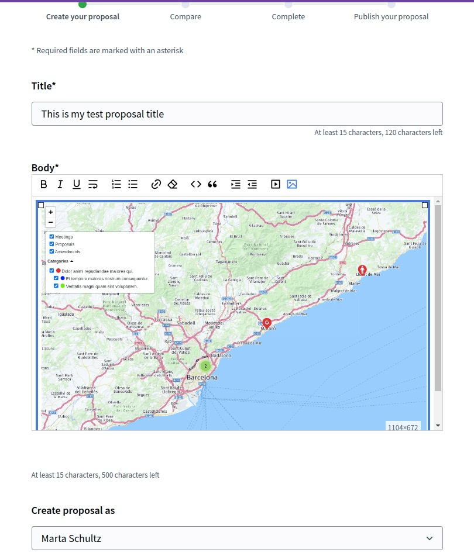
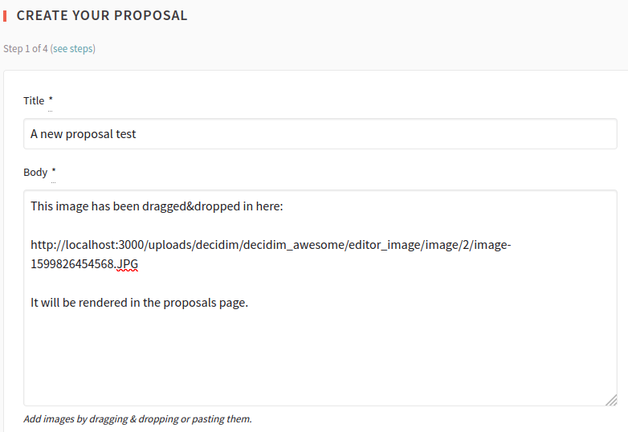

# Editor and content creation

## Tweaks

### 1.1 Image support for the RichText editor

Adds image upload and drag & drop support to the WYSIWYG editor used in admin/public rich text contexts.
The uploaded images are stored as external resources (not base64 inline content).

#### Admin description

Enables editorial teams to embed images directly in rich text areas without reverting to external hosting or links.
Concerns include storage quota management and image moderation workflows.
Recommend enabling image upload size limits in administration settings to prevent storage overflow.

#### Technical area

- **Configuration:** Via initializer (affects default state; admins can always restrict scope)

```ruby
# config/initializers/awesome_defaults.rb
Decidim::DecidimAwesome.configure do |config|
  # true = enabled by default globally (admins can restrict to specific scopes)
  # false = disabled by default (admins CAN enable using scope restrictions)
  # :disabled = completely removed, hidden from admins
  config.allow_images_in_editors = false  # default: false
end
```

- **Admin visibility:** Enabled (admins see Settings → Ckeditor options toggle)
- **Default behavior:** Disabled by default; admins can enable using scope restrictions (see [Global mechanisms](global-mechanisms.md))
- **Admin control:** Yes; toggle on/off and apply scope restrictions (see [Global mechanisms](global-mechanisms.md))
- **Performance:** Minimal impact; images stored as URLs, not base64. Monitor file storage quotas periodically.
- **Prerequisites:** Valid file storage backend configured (local, S3, etc.)
- **Moderation:** Images are subject to standard content moderation policies; no special review needed



### 1.2 Images in proposals

Allows users to drag & drop images into proposal textareas even when public rich text is not enabled.
Useful when proposals use plain text input but still need media attachments.

#### Admin description

Balances structured proposal text with visual content from participants. Reduces friction for visual storytelling.
Concerns: manage image quality expectations and moderation volume. Combined with Tweak 2.1 (custom fields), can structure images alongside metadata.
Recommend clear guidelines for image size and format in help text.

#### Technical area

- **Configuration:** Via initializer or admin panel per component

```ruby
# config/initializers/awesome_defaults.rb
Decidim::DecidimAwesome.configure do |config|
  # true = enabled by default globally (admins can restrict to specific scopes)
  # false = disabled by default (admins CAN enable using scope restrictions)
  # :disabled = completely removed, hidden from admins
  config.allow_images_in_proposals = false  # default: false
end
```

- **Admin visibility:** Enabled (admins see Settings → Components toggle per proposal component)
- **Default behavior:** Disabled by default; admins can enable using scope restrictions (see [Global mechanisms](global-mechanisms.md))
- **Admin control:** Yes; toggle on/off and apply scope restrictions (see [Global mechanisms](global-mechanisms.md))
- **Storage:** Same backend as editor images; validate combined quota limits if both tweaks enabled
- **Performance:** Negligible impact; images indexed alongside proposals for search
- **Moderation:** Follows standard proposal moderation workflow; images included in admin review


