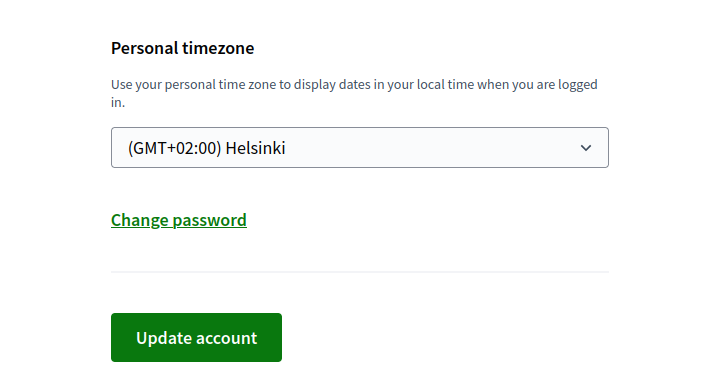
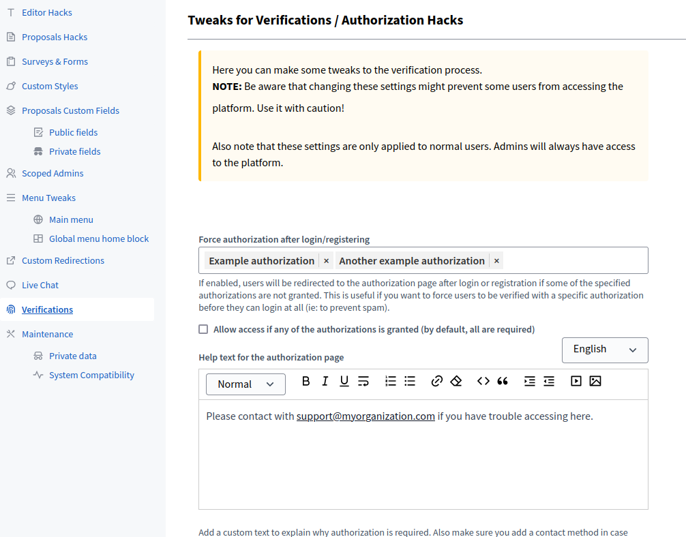
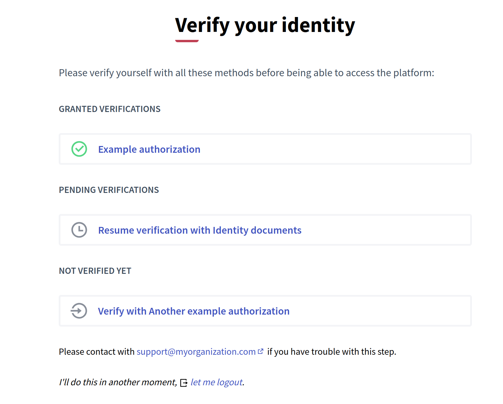
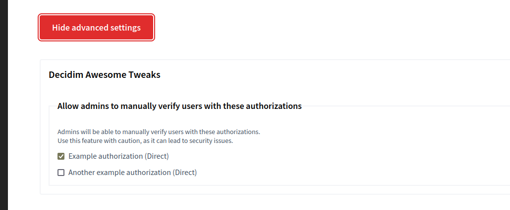
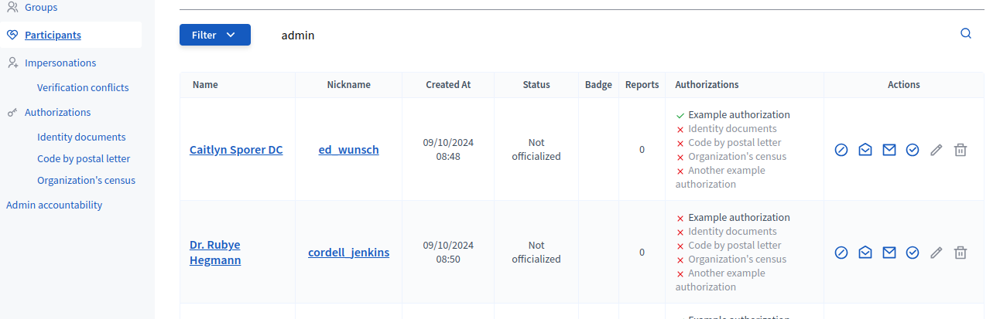
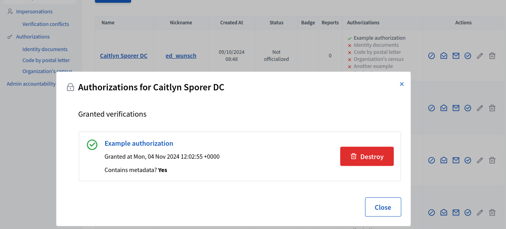
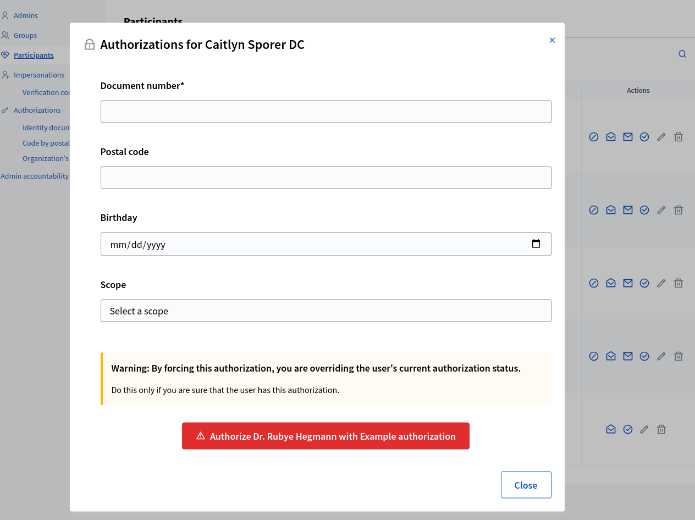
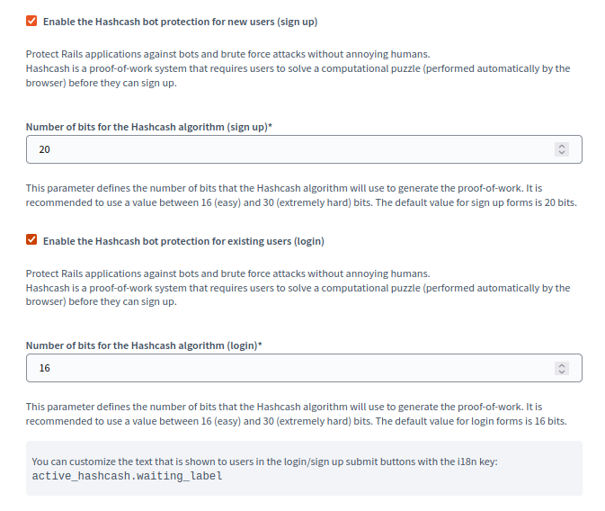
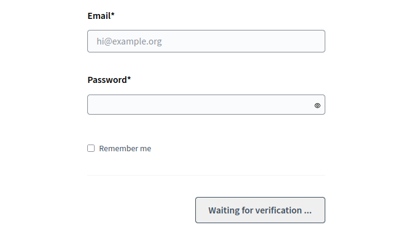

# Forms, surveys and verifications

## Tweaks

### 5.1 Auto-save for surveys and forms

Stores in-progress form data in browser local storage and restores it when users return to the same form context.

#### Admin description

Reduces form abandonment by preserving participant work-in-progress. Especially valuable for long or multi-step forms.
Concerns: local storage is device-specific (not synced across devices). Privacy-conscious users may worry about unencrypted browser storage.
Recommend enabling clear disclosure ("Your progress is saved locally on this device") in form help text.

#### Technical area

- **Enabling/Disabling:** Enabled by default; can be disabled via initializer

```ruby
# config/initializers/awesome_defaults.rb
Decidim::DecidimAwesome.configure do |config|
  config.auto_save_forms = true  # default: true
  
  # Or disable (feature off):
  # config.auto_save_forms = :disabled
end
```

- **Storage:** Browser localStorage (same-origin, persistent across browser sessions)
- **Scope:** Form-specific (each form has its own save key); doesn't interfere across pages
- **Clearing:** Users can manually delete localStorage via browser settings; automatic cleanup after 30 days of inactivity (configurable)
- **Security:** Data not encrypted; only use for non-sensitive form fields. Do not auto-save passwords or tokens.
- **Performance:** Negligible impact; localStorage operations are synchronous and fast
- **Compatibility:** Works on all modern browsers; gracefully degrades on private browsing mode (no persistence)
- **GDPR:** LocalStorage is participant device data; consider privacy policy implications


### 5.2 User custom timezone

Lets users set their own timezone to view dates/times according to personal locale preferences.

#### Admin description

Improves experience for distributed participants across regions without forcing admin timezone conversion.
Concerns: timezone selection can confuse users if poorly labeled; some UI elements may still show server timezone.
Recommend prominently showing participants their selected timezone in account settings; test that event deadlines display correctly.

#### Technical area

- **Enabling/Disabling:** Disabled by default; enable via initializer

```ruby
# config/initializers/awesome_defaults.rb
Decidim::DecidimAwesome.configure do |config|
  # true = enabled (users see timezone selector in account settings)
  # false = disabled (users don't see selector, but admins can manually set timezones for users)
  # :disabled = completely removed, hidden from admins
  config.user_timezone = false  # default: false
end
```

- **Admin visibility:** Enabled (admins see user timezone option in Settings)
- **Default behavior:** Disabled by default (timezone selector hidden from user account settings)
- **Admin control:** Yes; can enable/disable globally or per-user

- **User setting:** Stored in user profile; applied globally across all pages and emails
- **Defaults:** Falls back to browser timezone detection or organization default if not explicitly set
- **Display:** All datetime UI elements converted to user timezone in JavaScript (no server rendering needed)
- **Emails:** User timezone applied to event notifications and deadlines in email format
- **API:** User timezone available in GraphQL/REST API for external integrations
- **Performance:** Minimal; lookup is cached in session
- **Compatibility:** Requires JavaScript; works across browsers and edge cases (e.g., DST transitions)



### 5.3 Mandatory verifications

Allows admins to enforce required authorization methods before users can access protected functionality.

#### Admin description

Restricts participation to verified users without custom code. Supports multi-method verification (passport, postal mail, etc.).
Concerns: mandatory verification reduces participation; clearly communicate why before users register.
Recommend pairing with Tweak 5.4 (manual verifications) to provide exception handling for edge cases.

#### Technical area

- **Enabling/Disabling:** Can be configured via initializer

```ruby
# config/initializers/awesome_defaults.rb
Decidim::DecidimAwesome.configure do |config|
  # {} (empty hash) = disabled, admins CAN configure per-component
  # { default config } = defaults set, admins can override per-component
  # :disabled = completely removed, hidden from admins
  config.force_authorizations = {}  # default: {}
  
  # OR with sample defaults:
  # config.force_authorizations = { "default" => ["Postal"] }
end
```

- **Admin visibility:** Enabled (admins see mandatory verification toggles per component)
- **Default behavior:** Disabled by default (no mandatory verification unless admin configures)
- **Admin control:** Yes; admins can set requirements per component or scope

- **Methods:** Supports all installed Decidim authorization backends (Postal, OIDC, Saml, etc.)
- **Configuration:** Admin panel per component; define which authorization method(s) are required
- **Enforcement:** Checked at access time; unverified users see "Verify account" prompt with clear next steps
- **Exemptions:** Scoped admins and staff can bypass checks (logged in Tweak 3.3 accountability)
- **Performance:** Verification status cached in session; no per-page queries after login
- **User experience:** Unverified users can browse but not participate; clear call-to-action to verify
- **Compatibility:** Works with all participation types (proposals, surveys, comments)




### 5.4 Manual verifications

Allows admins to manually manage supported direct authorizations for users, with accountability logging.

#### Admin description

Enables support teams to grant verifications for users who fall through automated processes (e.g., passport lost, postal mail failed).
Concerns: granular permission controls needed to prevent privilege escalation; logging essential for compliance.
Recommend requiring two approvals for sensitive verification grants; always audit suspicious patterns.

#### Technical area

- **Supported methods:** All installed direct authorization methods (postal lists, custom backends)
- **Configuration:** Available authorizations configurable via initializer

```ruby
# config/initializers/awesome_defaults.rb
Decidim::DecidimAwesome.configure do |config|
  # Specify which authorization methods admins can manually grant
  config.admins_available_authorizations = [
    "Postal",
    "Saml"
  ]
  
  # Or completely remove/hide from admins:
  # config.admins_available_authorizations = :disabled
end
```

- **Admin UI:** Search user, select authorization method, grant/revoke with mandatory note
- **Logging:** All grants/revokes logged with timestamp, granter, reason; visible in Tweak 3.3 accountability
- **Expiry:** Can set expiration date on manual grants (default: no expiry unless configured)
- **Validation:** Duplicate grants prevented; revocation immediate
- **Audit:** Manual grants marked distinctly from automated verifications for reporting
- **Dependency:** Complements Tweak 5.3 (mandatory verifications) for exception handling






### 5.5 HashCash anti-bot login/registration

Adds proof-of-work challenge validation to login/registration flows to reduce automated abuse.

#### Admin description

Lightweight spam/bot defense without third-party services (reCAPTCHA, etc.) or additional friction beyond CPU cost.
Concerns: proof-of-work takes 1-5 seconds on participant device; some users may abandon if impatient. Difficulty configurable.
Recommend setting difficulty low initially; monitor spam rates and increase if abuse persists. Educational institutions may need exemptions.

#### Technical area

- **Enabling/Disabling:** Disabled by default; enable via initializer

```ruby
# config/initializers/awesome_defaults.rb
Decidim::DecidimAwesome.configure do |config|
  # Enable HashCash for signup forms
  config.hashcash_signup = true  # default: false
  config.hashcash_signup_bits = 20  # difficulty: default 20 bits (~2-5 seconds)
  
  # Enable HashCash for login forms  
  config.hashcash_login = true  # default: false
  config.hashcash_login_bits = 16  # difficulty: default 16 bits (faster than signup)
  
  # Or completely remove/hide from admins:
  # config.hashcash_signup = :disabled
  # config.hashcash_login = :disabled
end
```

- **Mechanism:** Browser performs proof-of-work computation (adjustable difficulty) before form submission
- **Difficulty:** Configurable admin setting; higher = more spam resistance but slower registration (test 2-5 second target)
- **Performance:** CPU-bound on client; zero server overhead. Modern browsers can solve in <5 seconds.
- **Accessibility:** May impact users on older devices or mobile networks; clear progress indicator recommended
- **Requirements:** JavaScript required; graceful degradation if disabled (show explanation and manual verification option)
- **Exemptions:** Can whitelist certain IPs or email domains for low-friction registration
- **Limitations:** Ineffective against coordinated high-resource attackers; pairs well with rate limiting




## Scope and operations

- Verify privacy expectations for client-side form persistence.
- Validate mandatory/forced verification paths against allowed controller configuration.
