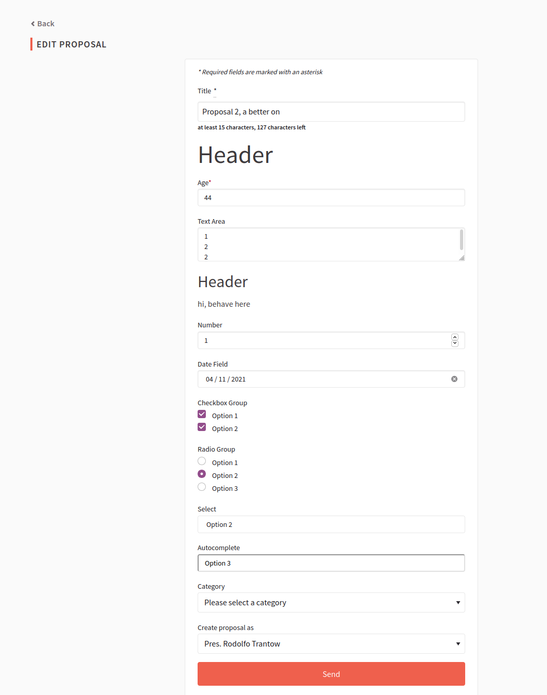
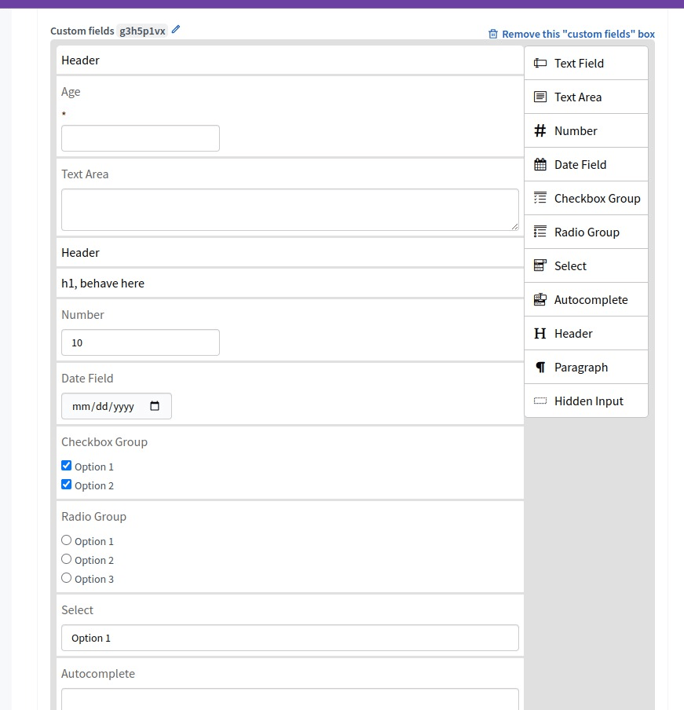
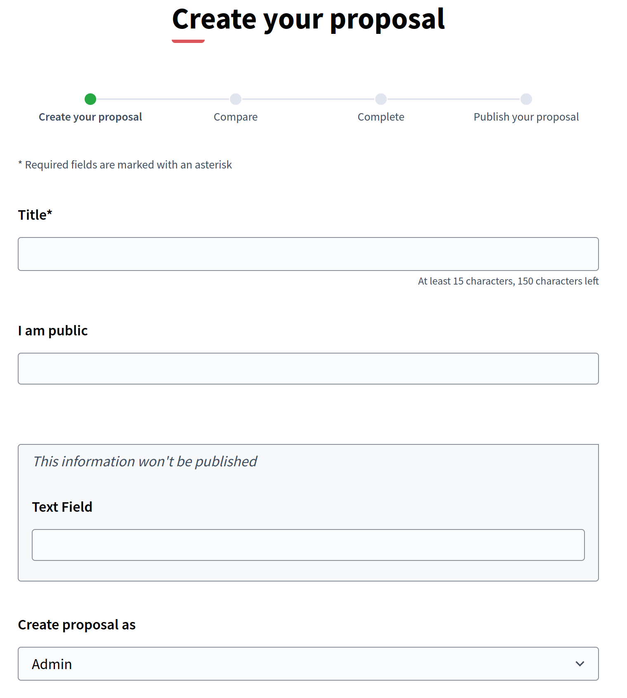
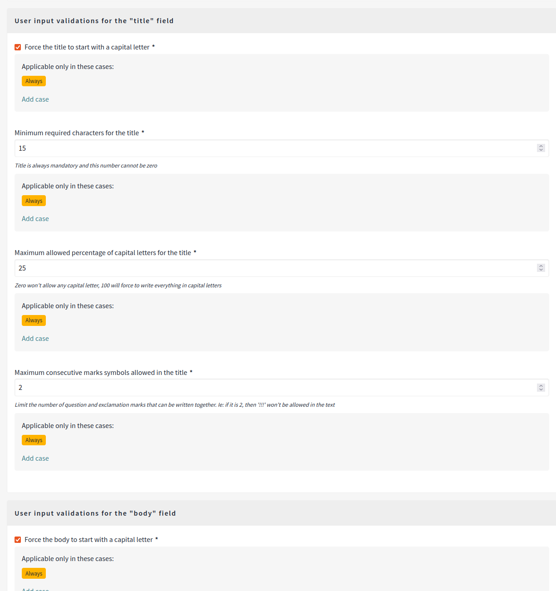
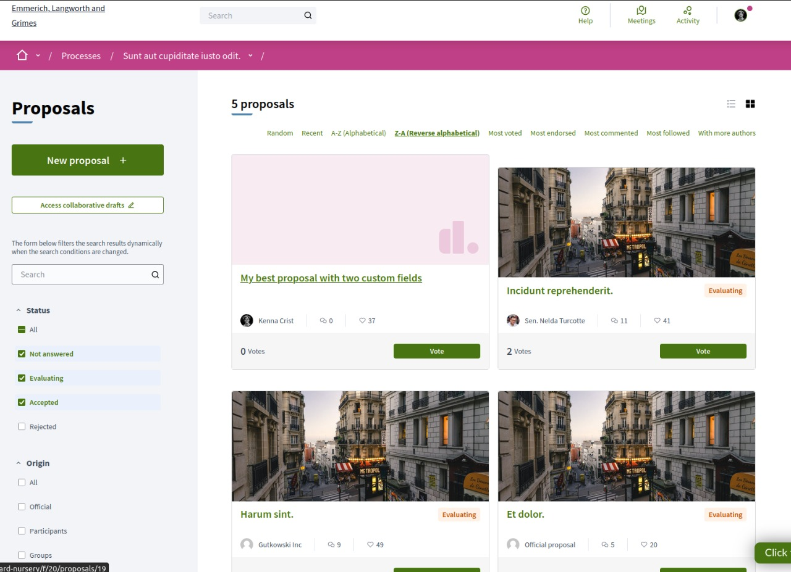
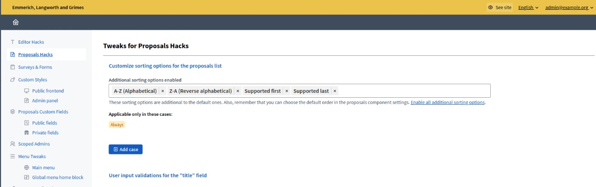
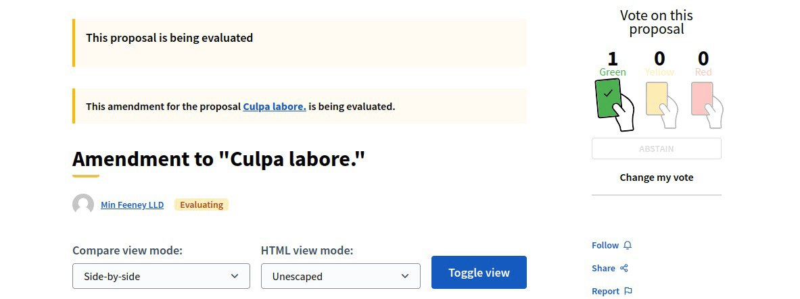

# Proposals and participation

## Tweaks

### 2.1 Custom fields for proposals

Replaces or augments proposal body input with configurable form fields defined by admins.
Supports scoped usage per component/space.

#### Admin description

Enforces consistent proposal structure and data collection. Essential for structured evaluation workflows (e.g., budget allocation, impact scoring).
Concerns: participant confusion if fields are poorly labeled; requires user guidance. Plan validation rules carefully to avoid false rejections.
Recommend testing the form with sample participants before full launch.

#### Technical area

- **Configuration:** Via initializer (affects default state; admins can always restrict scope)

```ruby
# config/initializers/awesome_defaults.rb
Decidim::DecidimAwesome.configure do |config|
  # :disabled = completely removed, hidden from admins
  # {} (empty) = admins can create custom fields dynamically per component
  config.proposal_custom_fields = {}  # default: {} (enabled, no defaults)
end
```

- **Admin visibility:** Enabled (admins see proposal component settings for custom fields)
- **Default behavior:** Disabled by default (no fields unless admin creates them)
- **Admin control:** Yes; admins define fields per component
- **Configuration:** Admin UI to add/edit/reorder fields with types (text, dropdown, checkbox, etc.)
- **GraphQL:** Exposed via GraphQL API (Tweak 2.1.1) for external integrations
- **Performance:** Minimal impact; fields are indexed for filtering and search
- **Dependencies:** Works with Tweak 2.3 (sorting) and Tweak 2.4 (weighted voting); custom fields can be sorting dimensions
- **Data privacy:** Consider GDPR implications if collecting sensitive personal data; use Tweak 2.1.2 for admin-only fields





### 2.1.1 GraphQL types for custom fields

Exposes custom proposal fields in GraphQL (e.g. `bodyFields`) for API consumers.

#### Admin description

Enables programmatic access to proposal metadata for dashboards, reports, or third-party integrations.
Concerns: schema consistency if fields change; communicate API changes to external consumers.
Recommend versioning GraphQL schema changes.

#### Technical area

- **Configuration:** Via initializer (auto-generated if custom fields exist)

```ruby
# config/initializers/awesome_defaults.rb
Decidim::DecidimAwesome.configure do |config|
  # GraphQL types are automatically exposed when Tweak 2.1 is configured
  # No explicit config needed; just ensure Tweak 2.1 has custom fields defined
end
```

- **Admin visibility:** N/A (this is API-only, no admin UI)
- **Default behavior:** Enabled when Tweak 2.1 has custom fields
- **Admin control:** No (auto-generated based on Tweak 2.1)
- **Exposure:** Custom fields automatically available in GraphQL queries via `bodyFields` array
- **Auth:** Respects same permissions as web UI (public fields visible to all, private fields to admins)
- **Caching:** GraphQL caches can be invalidated when custom fields change
- **Integration:** Commonly used with external reporting or BI tools
- **Dependency:** Requires Tweak 2.1 enabled; this is its API extension

### 2.1.2 Private custom fields

Adds admin-only custom fields for proposals, intended for private metadata.
Field values are stored encrypted.

#### Admin description

Separates internal scoring/notes from public proposal data. Useful for blind evaluation or sensitive assessment criteria.
Concerns: staff must understand these fields are hidden; prevent accidental exposure.
Recommend labeling private fields clearly in admin UI (e.g., "Internal reviewer notes — not visible to public").

#### Technical area

- **Configuration:** Via initializer (affects default state; admins can always restrict scope)

```ruby
# config/initializers/awesome_defaults.rb
Decidim::DecidimAwesome.configure do |config|
  # :disabled = completely removed, hidden from admins
  # {} (empty) = admins can create private fields dynamically per component
  config.proposal_private_custom_fields = {}  # default: {} (enabled, no defaults)
end
```

- **Admin visibility:** Enabled (admins see proposal component settings for private fields)
- **Default behavior:** Disabled by default (no fields unless admin creates them)
- **Admin control:** Yes; admins define private fields per component
- **Visibility:** Private fields hidden from API, frontend, and proposals themselves; admin-only access
- **Encryption:** Values encrypted at-rest in database
- **Audit:** Changes to private fields logged in accountability trail (Tweak 3.3)
- **Performance:** Encrypted fields require decryption on admin view; negligible impact
- **Backup:** Ensure backup procedures preserve encryption keys; decryption loss = data loss
- **Dependency:** Pairs with Tweak 3.3 (Admin accountability) for audit compliance



### 2.2 Custom validation rules for proposal title/body

Configures proposal content rules such as minimum length, capitalization limits, punctuation limits and required initial uppercase.

#### Admin description

Enforces baseline writing quality and reduces spam/low-effort submissions without moderation overhead.
Concerns: rules that are too strict discourage participation; too loose allow spam. Communicate rules clearly in submission help text.
Recommend rule testing with real participant samples before deployment.

#### Technical area

- **Configuration:** Via initializer (affects default state; admins can always restrict scope)

```ruby
# config/initializers/awesome_defaults.rb
Decidim::DecidimAwesome.configure do |config|
  # Set validation rules (all false by default, meaning no validation)
  config.validate_title_min_length = 15          # or :disabled to completely remove/hide this rule
  config.validate_title_max_caps_percent = 25
  config.validate_title_max_marks_together = 1
  config.validate_title_start_with_caps = true
  
  config.validate_body_min_length = 15
  config.validate_body_max_caps_percent = 25
  config.validate_body_max_marks_together = 1
  config.validate_body_start_with_caps = true
end
```

- **Admin visibility:** Enabled (admins see Settings → Proposals → Content rules)
- **Default behavior:** Disabled by default (no validation unless explicitly configured)
- **Admin control:** Yes; admins can enable/disable rules per component
- **Rules available:** Min/max length, capitalization percentage, punctuation limits, uppercase requirement
- **Client-side:** Validation happens on form submission; browser error messages guide users
- **Server-side:** Rules enforced server-side to prevent bypass; tampering with frontend data is rejected
- **Performance:** Negligible; regex validation at submission time
- **Localization:** Rules can be localized if minimum lengths vary per language



### 2.3 Additional proposal sortings

Adds extra sorting methods (e.g. supported first/last, A-Z, Z-A), with optional session persistence of selected sorting.

#### Admin description

Improves proposal discovery by offering sorting dimensions beyond default ranking. Customizable per component.
Concerns: too many sorting options can confuse participants; focus on the most relevant 2-3 options.
Recommend combining with Tweak 2.4 (weighted voting) or Tweak 2.1 (custom fields) for meaningful sorting dimensions.

#### Technical area

- **Configuration:** Via initializer (affects default sorting options)

```ruby
# config/initializers/awesome_defaults.rb
Decidim::DecidimAwesome.configure do |config|
  # Array of sorting options (true by default, all available)
  # :disabled = completely removed, hidden from admins
  config.additional_proposal_sortings = [
    :supported_first,  # most supported first
    :supported_last,   # least supported first
    :az,               # A-Z alphabetical
    :za                # Z-A alphabetical
  ]
end
```

- **Admin visibility:** Enabled (admins see sorting options per component)
- **Default behavior:** Enabled by default (all sorting options available)
- **Admin control:** Yes; can enable/disable sorting options per component
- **Session persistence:** Selected sort preference stored in browser session; survives page reload
- **Custom sorts:** Can base sorts on custom fields (Tweak 2.1) for data-driven ordering
- **Performance:** Sorting is database-indexed; minimal query overhead even for large proposal counts
- **API support:** Sorting options available via GraphQL if API consumption required
- **Conflict:** Incompatible with Tweak 2.4 if weighted voting is sorting dimension alone; recommend both enabled




### 2.4 Weighted voting

Enables configurable weighted vote systems for proposals, with support for custom voting manifests.

#### Admin description

Supports non-standard voting models (e.g., votes with point allocations, ranked choice, multi-vote pools).
Concerns: participants must understand voting rules clearly; complex voting can reduce participation. Provide strong help text and examples.
Recommend A/B testing against standard voting if unsure about user comprehension.

#### Technical area

- **Configuration:** Via initializer (affects default state globally)

```ruby
# config/initializers/awesome_defaults.rb
Decidim::DecidimAwesome.configure do |config|
  # true = enabled by default globally (admins can restrict to specific components)
  # false = disabled by default (admins CAN enable per-component)
  # :disabled = completely removed, hidden from admins
  config.weighted_proposal_voting = true  # default: true
end
```

- **Admin visibility:** Enabled (admins see weighted voting options per component)
- **Default behavior:** Enabled by default globally; admins can disable per-component
- **Admin control:** Yes; admins set voting model per component
- **Voting models:** Supports distributed-vote pools, ranked choice, Borda counting, custom algorithms
- **Data export:** Vote distribution available in component reports for analysis
- **Performance:** Vote aggregation queries are indexed; reporting scales well to large proposal counts
- **Recount:** After model changes, votes are recalculated; no historical data loss
- **Accessibility:** Ensure weighted voting UI works with screenreaders; test with participants using AT
- **Dependency:** Works well with Tweak 2.3 (sorting) to surface weighted-vote leaders; conflicts with simple vote-count sorting



### 2.5 Limiting amendments in proposals

Limits concurrent amendments in evaluating state (typically to one), while not affecting accepted/rejected amendments.

#### Admin description

Prevents amendment backlog and uncontrolled collaborative edits on sensitive proposals.
Concerns: proposers frustrated by "locked" proposals may resubmit instead of amending.
Recommend pairing with clear notifications (e.g., "Amendment in progress, try again tomorrow").

#### Technical area

- **Configuration:** Via initializer (affects whether admins can set amendment limits)

```ruby
# config/initializers/awesome_defaults.rb
Decidim::DecidimAwesome.configure do |config|
  # true = admins CAN set amendment limit per component (default: false)
  # false = feature disabled, admins cannot limit amendments
  # :disabled = completely removed, hidden from admins
  config.allow_limiting_amendments = false  # default: false
end
```

- **Admin visibility:** Disabled by default (checkbox hidden from admins)
- **Default behavior:** Disabled by default; setting `allow_limiting_amendments = true` shows the amendment limit option in admin UI
- **Admin control:** Yes (if allow_limiting_amendments = true); admins can toggle limit per component
- **Scope:** Applies to proposals in evaluating/answering state only; completed amendments unaffected
- **Lock mechanism:** Only one amendment allowed in-flight; proposer must wait for decision before resubmitting
- **Configurable limit:** Can adjust max concurrent amendments per component (default 1)
- **Performance:** Amendment locking adds minimal overhead; database constraint prevents race conditions
- **Notifications:** Proposers notified when amendment decision made; can resubmit immediately
- **Compatibility:** Works with all proposal types and voting models


