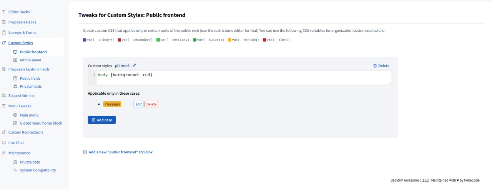
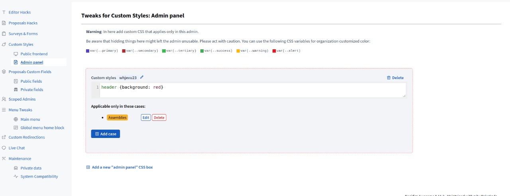
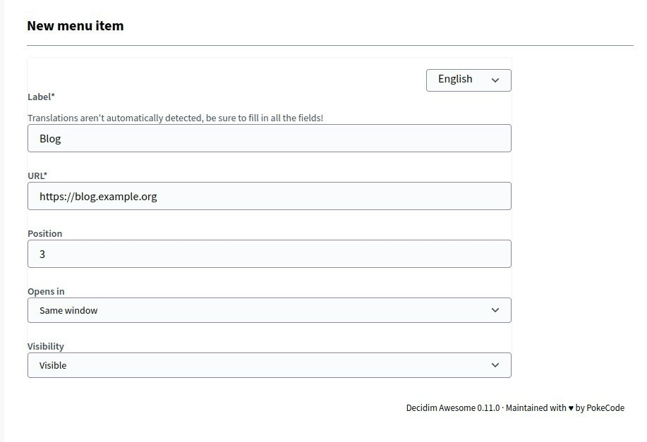
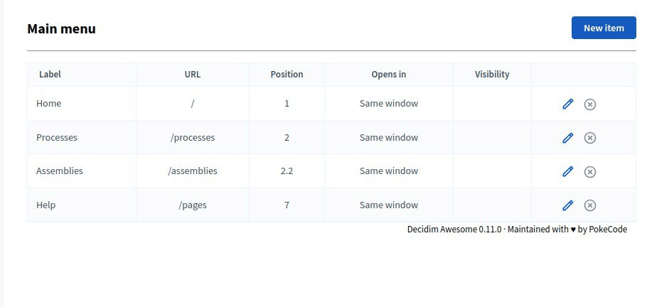
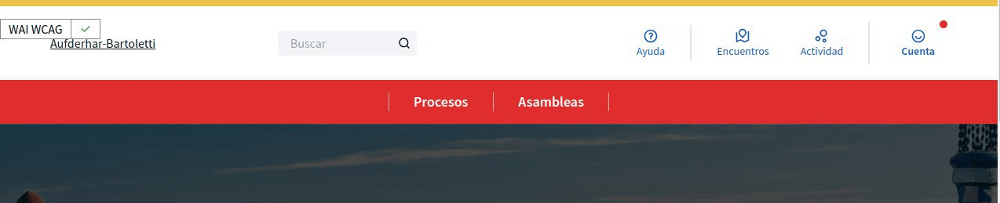
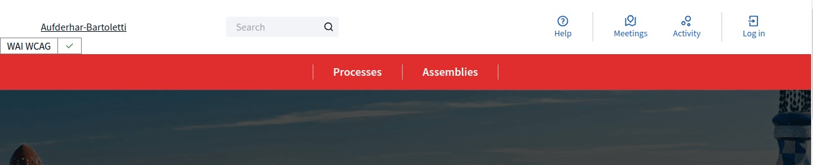
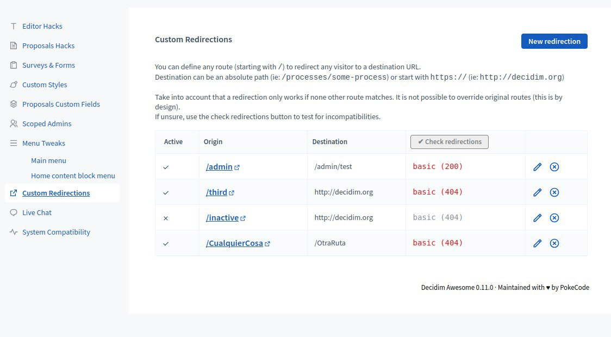

# UI, theming and navigation

## Tweaks

### 4.1 Custom CSS with scoped restrictions

Adds configurable CSS snippets with scope control.

#### Admin description

Enables rapid branding/UX tweaks without requiring frontend developer time or redeployment.
Concerns: CSS can break layouts if poorly tested; invalid CSS logs warnings but doesn't crash site.
Recommend maintaining a shared CSS style guide and testing across browsers before deploying site-wide.

#### Technical area

- **Enabling/Disabling:** Use a Hash/default snippets to keep it available; use `:disabled` to completely remove/hide from admins

```ruby
# config/initializers/awesome_defaults.rb
Decidim::DecidimAwesome.configure do |config|
  # Completely remove/hide public custom CSS
  config.scoped_styles = :disabled
  
  # OR configure with default CSS snippets (admin can still override):
  config.scoped_styles = {
    "homepage_banner" => ".homepage { background: linear-gradient(...); }"
  }
end
```

- **Storage:** Custom CSS stored in database; injected into page `<head>` at runtime
- **Scope:** Can be global or per-space/component using Tweak 3.1 (scope restrictions)
- **Performance:** No performance impact; CSS parsed and cached by browser
- **Security:** No script injection allowed; CSS validated server-side; malicious selectors rejected
- **Specificity:** Custom CSS injected after theme CSS; can override with `!important` if needed
- **Browser support:** CSS3 only; IE11 not supported for modern syntax

#### 4.1.1 Public styles

Apply custom CSS to public-facing views globally or by restricted scope.

**Admin guidance:** Ideal for homepage branding, component card styling, participant-facing layouts. Use scoped rules per participatory space if different processes need different branding.



#### 4.1.2 Admin styles

Apply custom CSS specifically to admin-facing views, also with scoping.

**Admin guidance:** Useful for admin-only UI refinements (e.g., highlight urgent tasks, recolor status badges). Less critical than public styles; lower audit frequency.

**Configuration:** Enabled by default (`{}`); use `:disabled` to remove it from admin UI:

```ruby
# config/initializers/awesome_defaults.rb
Decidim::DecidimAwesome.configure do |config|
  config.scoped_admin_styles = :disabled  # completely removed, hidden from admins
  
  # OR with default snippets:
  config.scoped_admin_styles = {
    "urgent_badge" => ".badge.urgent { background: red; }"
  }
end
```



### 4.2 Main menu customization

Enables adding, editing, hiding and reordering menu items, with optional conditions and target behavior.

#### Admin description

Guides participants toward key processes/content without code changes. Requires clear information architecture planning.
Concerns: too many menu items overwhelm users; removed items may break user workflows. Plan menu structure before enabling.
Recommend conducting user research on navigation patterns; test menu depth (avoid 3+ levels).

#### Technical area

- **Enabling/Disabling:** Enabled by default; can be disabled globally via initializer

```ruby
# config/initializers/awesome_defaults.rb
Decidim::DecidimAwesome.configure do |config|
  config.menu = :disabled  # disable menu customization completely
  
  # OR configure with default menu items (admin can still override):
  config.menu = [
    {
      url: "/faq",
      label: { "en" => "FAQ", "es" => "Preguntas frecuentes" },
      position: 10
    }
  ]
end
```

- **Customization:** Admin UI to add/edit/reorder/hide menu items; conditional visibility (e.g., "show only if logged in")
- **Link types:** Internal routes (processes, components) or external URLs
- **Icon support:** Can add icon classes from default Decidim icon set
- **Scope:** Menu customization can be partially scoped (Tweak 3.1) for different space configurations
- **Performance:** Menu rendered server-side; minimal query overhead
- **Mobile:** Responsive menu collapses; custom items included in hamburger menu
- **Conflict:** Overriding top-level navigation structure may conflict with participant expectations; A/B test changes






### 4.3 Custom redirections

Adds short-path redirects to internal/external destinations, with optional query-string sanitization.

#### Admin description

Creates user-friendly URLs for campaigns, outreach, and deep links without DNS changes.
Concerns: broken redirects frustrate users; monitor redirect hit counts to detect drift or misuse.
Recommend avoiding "generic" redirects (e.g., /budget → may collide with future features); use specific paths like /budget-2025.

#### Technical area

- **Enabling/Disabling:** Enabled by default (`{}`); use `:disabled` to completely remove/hide from admins

```ruby
# config/initializers/awesome_defaults.rb
Decidim::DecidimAwesome.configure do |config|
  config.custom_redirects = :disabled  # completely removed, hidden from admins
  
  # OR configure with default redirects (admin can still override):
  config.custom_redirects = {
    "/old-page" => {
      destination: "https://example.com/new-page",
      active: true
    }
  }
end
```

- **Configuration:** Admin UI to define source path and target URL
- **Types:** Internal routes (to processes, components) or external URLs
- **Query strings:** Can strip/preserve query parameters for cleaner external links
- **Performance:** Redirects cached; one database lookup per unique source path
- **HTTP status:** Uses 301 (permanent) or 302 (temporary) configurable per redirect
- **Analytics:** Target URL receives full referrer; source path not logged to external sites
- **Conflicts:** Redirect paths cannot conflict with existing routes; admin UI prevents creation



## Scope and operations

- Prefer minimal scoped style changes to reduce unintended side effects.
- Validate custom redirects to avoid collisions with existing routes.
