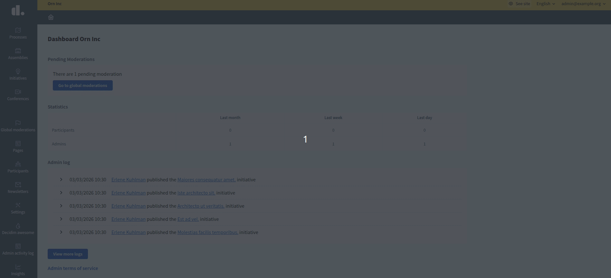
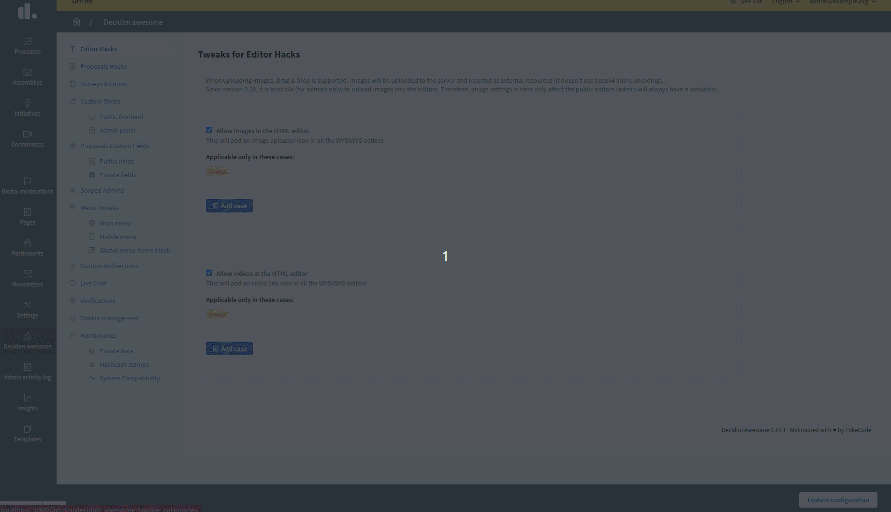

# UI, theming and navigation

## Tweaks

### 4.1 Custom CSS with scoped restrictions

Adds configurable CSS snippets with scope control.

#### Admin description

Enables rapid branding/UX tweaks without requiring frontend developer time or redeployment.
Concerns: CSS can break layouts if poorly tested. Invalid CSS/Sass entered via the admin UI is blocked by server-side syntax validation, while invalid CSS provided via an initializer will be sent to the browser as written.
Recommend maintaining a shared CSS style guide and testing across browsers before deploying site-wide.

#### Technical area

- **Enabling/Disabling:** Use a Hash of default snippets to keep it available; use `:disabled` to completely remove/hide from admins

```ruby
# config/initializers/awesome_defaults.rb
Decidim::DecidimAwesome.configure do |config|
  # Completely remove/hide public custom CSS
  config.scoped_styles = :disabled
  
  # OR configure with default CSS snippets (admin can still override):
  config.scoped_styles = {
    "homepage_banner" => ".homepage { background: linear-gradient(...); }"
  }
end
```

- **Storage:** Custom CSS stored in database; injected into page `<head>` at runtime
- **Scope:** Can be global or per-space/component using scope restrictions (see [Global mechanisms](global-mechanisms.md))
- **Performance:** No performance impact; CSS parsed and cached by browser
- **Security:** No script injection via CSS; styles are syntax-validated server-side (CSS/Sass); no automatic filtering of unsafe selectors
- **Specificity:** Custom CSS injected after theme CSS; can override with `!important` if needed

#### 4.1.1 Public styles

Apply custom CSS to public-facing views globally or by restricted scope.

**Admin guidance:** Ideal for homepage branding, component card styling, participant-facing layouts. Use scoped rules per participatory space if different processes need different branding.


#### 4.1.2 Admin styles

Apply custom CSS specifically to admin-facing views, also with scoping.

**Admin guidance:** Useful for admin-only UI refinements (e.g., highlight urgent tasks, recolor status badges). Less critical than public styles; lower audit frequency.

**Configuration:** Enabled by default (`{}`); use `:disabled` to remove it from admin UI:

```ruby
# config/initializers/awesome_defaults.rb
Decidim::DecidimAwesome.configure do |config|
  config.scoped_admin_styles = :disabled  # completely removed, hidden from admins
  
  # OR with default snippets:
  config.scoped_admin_styles = {
    "urgent_badge" => ".badge.urgent { background: red; }"
  }
end
```


### 4.2 Main menu customization

Enables adding, editing, hiding and reordering menu items, with optional conditions and target behavior.

#### Admin description

Guides participants toward key processes/content without code changes. Requires clear information architecture planning.
Concerns: too many menu items overwhelm users; removed items may break user workflows. Plan menu structure before enabling.
Recommend conducting user research on navigation patterns; test menu depth (avoid 3+ levels).

#### Technical area

- **Enabling/Disabling:** Enabled by default; can be disabled globally via initializer

```ruby
# config/initializers/awesome_defaults.rb
Decidim::DecidimAwesome.configure do |config|
  config.menu = :disabled  # disable menu customization completely
  
  # OR configure with default menu items (admin can still override):
  config.menu = [
    {
      url: "/faq",
      label: { "en" => "FAQ", "es" => "Preguntas frecuentes" },
      position: 10
    }
  ]
end
```

- **Customization:** Admin UI to add/edit/reorder/hide menu items; conditional visibility (e.g., "show only if logged in")
- **Link types:** Internal routes (processes, components) or external URLs
- **Icon support:** Can add icon classes from default Decidim icon set
- **Scope:** Menu customization can be partially scoped using scope restrictions (see [Global mechanisms](global-mechanisms.md))
- **Performance:** Menu rendered server-side; minimal query overhead
- **Mobile:** Responsive menu collapses; custom items included in hamburger menu


### 4.3 Custom redirections

Adds short-path redirects to internal/external destinations, with optional query-string sanitization.

#### Admin description

Creates user-friendly URLs for campaigns, outreach, and deep links without DNS changes.
Concerns: broken redirects frustrate users; monitor redirect hit counts to detect drift or misuse.
Recommend avoiding "generic" redirects (e.g., /budget → may collide with future features); use specific paths like /budget-2025.

#### Technical area

- **Enabling/Disabling:** Enabled by default (`{}`); use `:disabled` to completely remove/hide from admins

```ruby
# config/initializers/awesome_defaults.rb
Decidim::DecidimAwesome.configure do |config|
  config.custom_redirects = :disabled  # completely removed, hidden from admins
  
  # OR configure with default redirects (admin can still override):
  config.custom_redirects = {
    "/old-page" => {
      destination: "https://example.com/new-page",
      active: true
    }
  }
end
```

- **Configuration:** Admin UI to define source path and target URL
- **Types:** Internal routes (to processes, components) or external URLs
- **Query strings:** Can strip/preserve query parameters for cleaner external links
- **Performance:** Each 404 triggers a lookup for a matching redirect; no additional in-application caching is currently applied
- **HTTP status:** Uses 302 (temporary redirect); not configurable per redirect
- **Conflicts:** Redirects are only applied on 404s, so they don't override existing routes, but admins should avoid defining redirects whose source matches a working route.


## Scope and operations

- Prefer minimal scoped style changes to reduce unintended side effects.
- Validate custom redirects to avoid collisions with existing routes.

### 4.4 Cookie management

Enables customizable cookie consent management with configurable categories and individual cookie items.

#### Admin description

Provides GDPR/privacy-compliant cookie consent with granular control over cookie categories and items. Extends Decidim's default consent modal with customizable categories, visibility controls, and detailed cookie documentation.
Concerns: misconfigured mandatory categories may block essential functionality; hidden categories won't appear in consent modal. 
Recommend documenting all cookies used by custom modules; review cookie categories quarterly to ensure compliance with privacy regulations.

#### Technical area

- **Enabling/Disabling:** Enabled by default (`true`); use `false` to disable by default (admins can still enable it); use `:disabled` to completely remove/hide from admins

```ruby
# config/initializers/awesome_defaults.rb
Decidim::DecidimAwesome.configure do |config|
  # Completely remove/hide cookie management
  config.cookie_management = :disabled
  
  # OR disable by default (admins can enable via UI):
  config.cookie_management = false
  
  # OR keep enabled (default):
  config.cookie_management = true
end
```

- **Storage:** Cookie categories and items stored in database; rendered in Decidim's data consent modal
- **Categories:** Each category has title, description, mandatory flag, and visibility setting
- **Visibility states:** `default` (visible to all users) or `hidden` (not shown in consent modal)
- **Cookie items:** Each item has name, type (cookie/localStorage), service name, and description
- **Default categories:** Extends Decidim's default consent categories (essential, analytics, preferences); default categories that are marked as mandatory are protected from editing/deletion to preserve essential functionality
- **Custom categories:** Admins can create additional categories (mandatory or optional) that are fully editable
- **Edit restrictions:** Only default categories that are BOTH from Decidim AND marked as mandatory cannot be edited; default non-mandatory categories and all custom categories (regardless of mandatory flag) are editable
- **Validation:** Cookie item names must be alphanumeric with underscores/hyphens only (no spaces)
- **Mandatory flag:** Mandatory categories cannot be disabled by users in the consent modal; both default and custom categories can be marked as mandatory
- **Performance:** Modal rendered on first visit; consent stored in browser localStorage
- **Compliance:** Supports GDPR/ePrivacy requirements; admin responsible for accurate cookie documentation

#### 4.4.1 Cookie categories

Organize cookies into logical groups with configurable visibility and mandatory settings.

**Admin guidance:** Use categories to group related cookies (e.g., "Analytics", "Social Media", "Advertising"). Mark essential cookies as mandatory. Hide categories for internal/technical cookies that don't require user consent.

**Category fields:**
- **Title:** Translatable category name shown to users
- **Description:** Translatable explanation of category purpose
- **Mandatory:** If checked, users cannot disable this category
- **Visibility:** `default` (shown in modal) or `hidden` (not displayed to users)

**Default categories:** Decidim provides default categories (essential, analytics, preferences). Default categories that are marked as mandatory (typically "essential") are protected from editing and deletion to preserve core functionality. Default non-mandatory categories (e.g., analytics, preferences) can be edited. Use "Reset to default" to restore original settings. Custom categories (regardless of mandatory flag) can be fully edited or deleted.



#### 4.4.2 Cookie items

Document individual cookies or localStorage items within each category.

**Admin guidance:** List all cookies/storage items used by your platform, including third-party services. Provide clear service names and descriptions for transparency.

**Item fields:**
- **Name:** Technical cookie/localStorage key (alphanumeric, underscores, hyphens only)
- **Type:** `cookie` or `localStorage`
- **Service:** Translatable name of service providing the cookie (e.g., "Google Analytics", "Session Management")
- **Description:** Translatable explanation of cookie purpose and data collected

**Validation:** Cookie names cannot contain spaces or special characters. Invalid names will show error: "Name format is invalid. Only letters, numbers, underscores and hyphens are allowed."

**Edit restrictions:** Items in default mandatory categories (typically "essential") are protected from editing and deletion to preserve core functionality. Items in default non-mandatory categories (e.g., analytics, preferences) and all custom categories (regardless of mandatory flag) can be fully edited or deleted.



